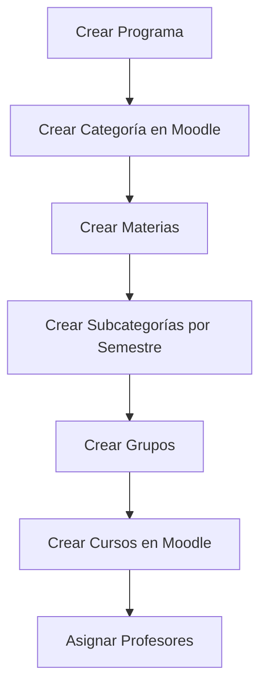
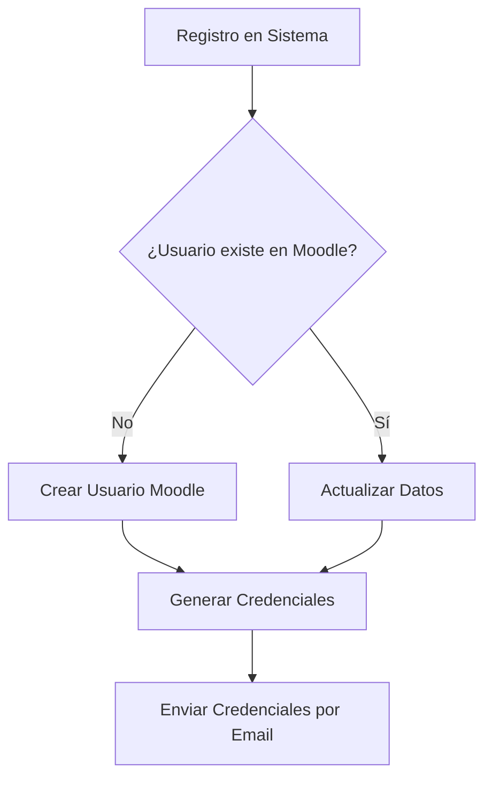
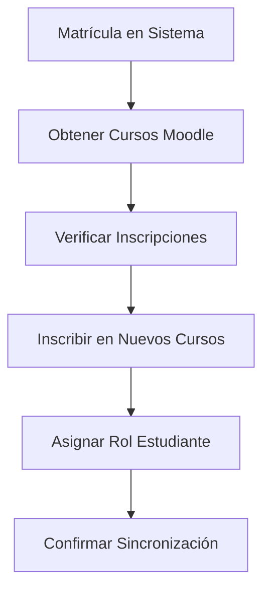

# Sistemas-Manager

## Descripción del Proyecto

Sistemas-Manager es una aplicación web integral para la gestión académica universitaria diseñada específicamente para programas de posgrado. El sistema facilita la administración completa del ciclo académico, desde la gestión de estudiantes y profesores hasta el seguimiento detallado de proyectos de investigación y trabajos de grado. Cuenta con integración completa con Moodle, permitiendo la sincronización automática de cursos, usuarios y matrículas.

## Características Principales

### 👥 Gestión de Usuarios

- **Estudiantes:** Registro completo con validaciones de código institucional (247XXXXXXX), gestión de información personal y académica, matriculación automática
- **Profesores:** Administración de docentes, asignación a grupos y materias, roles de director y codirector
- **Administradores:** Sistema de roles jerárquicos (Admin, SuperAdmin), control granular de permisos y accesos

### 🎓 Gestión Académica

- **Programas:** Creación y administración de programas de posgrado (Maestrías, Especializaciones)
- **Pensums:** Configuración de planes de estudio por programa con versionado
- **Materias:** Gestión de asignaturas con créditos, semestres, prerrequisitos y competencias
- **Grupos:** Vinculación inteligente de materias con docentes, cohortes y horarios
- **Cohortes:** Organización de estudiantes por periodos académicos

### 📚 Procesos Académicos

- **Matrículas:** Sistema completo de inscripción con inclusiones, exclusiones y cambios
- **Cancelaciones y Aplazamientos:** Gestión de solicitudes con workflow de aprobación
- **Contraprestaciones:** Administración de servicios académicos complementarios
- **Notas:** Registro, consulta y reportes de calificaciones con validaciones
- **Reintegros:** Proceso de reincorporación de estudiantes

### 🔬 Gestión de Proyectos de Investigación

- **Seguimiento por Fases:** Sistema de 9 fases del proyecto (desde propuesta hasta sustentación final)
- **Estados del Proyecto:** Control detallado del progreso y actividades pendientes
- **Informes Académicos:** Gestión de entregas, revisiones y retroalimentación
- **Sustentaciones:** Programación y evaluación de anteproyectos y tesis
- **Directores y Jurados:** Asignación y gestión de roles académicos
- **Documentación:** Almacenamiento y control de versiones de documentos del proyecto

### 🏫 Integración con Moodle

- Creación automática de categorías jerárquicas (Programa → Semestre → Materia)
- Sincronización bidireccional de usuarios con roles apropiados
- Gestión automatizada de inscripciones (enrollments) en cursos
- Asociación mediante IDs únicos para mantener consistencia
- Creación de usuarios con credenciales seguras generadas automáticamente

## Tecnologías Utilizadas

### Frontend Core

[](https://reactjs.org/)
[](https://vitejs.dev/)
[](https://www.typescriptlang.org)
[](https://reactrouter.com/)

### Interfaz de Usuario

[](https://heroui.com) - Biblioteca de componentes moderna
[](https://tailwindcss.com) - Framework CSS utilitario
[](https://tailwind-variants.org) - Gestión de variantes
[](https://www.framer.com/motion) - Animaciones fluidas

### Comunicación y Estado

[](https://axios-http.com/) - Cliente HTTP
[](https://www.npmjs.com/package/jwt-decode) - Autenticación
[](https://www.npmjs.com/package/@react-oauth/google) - Autenticación Google

### Iconografía y Recursos

[](https://lucide.dev/) - Iconos SVG
[](https://react-icons.github.io/react-icons/) - Biblioteca de iconos

### Herramientas de Desarrollo

[](https://eslint.org/) - Análisis de código
[](https://prettier.io/) - Formateo de código
[](https://postcss.org/) - Procesamiento CSS

### Despliegue y Containerización

[](https://www.docker.com/) - Containerización
[](https://nginx.org/) - Servidor web para producción
[](https://vercel.com/) - Despliegue optimizado

### Características Técnicas Adicionales

- **Sistema de Autenticación:** JWT + Google OAuth 2.0 integrado
- **Manejo de Estados:** Context API de React para gestión global
- **Validación de Formularios:** Validaciones en tiempo real con retroalimentación
- **Internacionalización:** Soporte para fechas y formatos colombianos
- **Notificaciones:** Sistema de alertas y modales personalizados
- **Gestión de Archivos:** Carga y descarga de documentos con validación

## Arquitectura del Proyecto

### Estructura de Directorios

El proyecto sigue una arquitectura modular y escalable organizada por funcionalidades:

```
📁 sistemas-manager/
├── 📁 public/                    # Recursos estáticos
│   ├── 🖼️ images/               # Imágenes y assets
│   └── 📄 vite.svg              # Logo de Vite
├── 📁 src/
│   ├── 📁 components/           # Componentes reutilizables
│   │   ├── 📁 admin/            # Componentes de administración
│   │   │   ├── AsignarDirectoresModal.jsx
│   │   │   ├── CambiarFaseModal.jsx
│   │   │   ├── CrearProyectoModal.jsx
│   │   │   └── CrearSustentacionForm.jsx
│   │   ├── 📁 auth/             # Componentes de autenticación
│   │   ├── 📁 proyectos/        # Componentes específicos de proyectos
│   │   │   ├── 📁 estado-proyecto/
│   │   │   ├── 📁 informes/
│   │   │   ├── 📁 listado-informes/
│   │   │   ├── 📁 listado-proyectos/
│   │   │   └── 📁 seguimiento/
│   │   ├── 📁 sidebar/          # Componentes de navegación
│   │   ├── 📁 sustentaciones/   # Gestión de sustentaciones
│   │   └── 🔧 [Componentes Base] # AlertaModal, Boton, CustomSelect, etc.
│   ├── 📁 context/              # Contextos de React
│   │   └── SidebarContext.jsx
│   ├── 📁 layouts/              # Layouts principales
│   │   ├── Layout.jsx
│   │   └── Sidebar.jsx
│   ├── 📁 lib/                  # Lógica de negocio y utilidades
│   │   ├── 📁 controllers/      # Controladores de API
│   │   │   ├── 📁 admin/        # Operaciones administrativas
│   │   │   ├── 📁 informes/     # Gestión de informes
│   │   │   ├── 📁 projects/     # Gestión de proyectos
│   │   │   └── ods.js           # Objetivos de Desarrollo Sostenible
│   │   ├── 📁 hooks/            # Hooks personalizados
│   │   │   ├── useAdmin.jsx
│   │   │   ├── useAuth.js
│   │   │   ├── useInformes.jsx
│   │   │   └── useProject.jsx
│   │   └── 📁 test/             # Datos de prueba y mock
│   ├── 📁 pages/                # Páginas de la aplicación
│   │   ├── 📁 admin/            # Páginas administrativas
│   │   │   ├── 📁 proyectos/    # AdminProyectos.jsx
│   │   │   └── 📁 sustentaciones/ # AdminGrupos.jsx
│   │   ├── 📁 administrador/    # Gestión de administradores
│   │   ├── 📁 aplazamientos/    # Gestión de aplazamientos
│   │   ├── 📁 cancelaciones/    # Gestión de cancelaciones
│   │   ├── 📁 cohorte/          # Gestión de cohortes
│   │   ├── 📁 contraprestaciones/ # Gestión de contraprestaciones
│   │   ├── 📁 estado-proyecto/  # Estado del proyecto
│   │   ├── 📁 grupos/           # Gestión de grupos académicos
│   │   ├── 📁 gruposMoodle/     # Integración con Moodle
│   │   ├── 📁 informes/         # Gestión de informes
│   │   ├── 📁 listadoInformes/  # Listados de informes
│   │   ├── 📁 listadoProyectos/ # Listados de proyectos
│   │   ├── 📁 listadoSustentaciones/ # Listados de sustentaciones
│   │   ├── 📁 login/            # Autenticación
│   │   ├── 📁 materias/         # Gestión de materias
│   │   ├── 📁 matricula/        # Proceso de matrícula
│   │   ├── 📁 notas/            # Gestión de notas
│   │   ├── 📁 pensum/           # Gestión de pensums
│   │   ├── 📁 programas/        # Gestión de programas
│   │   ├── 📁 reintegros/       # Gestión de reintegros
│   │   ├── 📁 seguimiento/      # Seguimiento de proyectos
│   │   ├── 📁 terminarSemestre/ # Cierre de semestre
│   │   └── 📁 usuarios/         # Gestión de usuarios
│   │       ├── 📁 estudiante/   # CrearEstudiante.jsx
│   │       ├── 📁 profesor/     # Gestión de profesores
│   │       └── 📁 admin/        # Gestión de administradores
│   └── 📁 styles/               # Estilos globales
│       └── globals.css
├── 📁 Docker & Deploy/          # Configuración de despliegue
│   ├── 🐳 Dockerfile           # Multi-stage build
│   ├── 🐳 docker-compose.yml   # Orquestación de servicios
│   ├── ⚙️ nginx.conf           # Configuración de Nginx
│   ├── 📜 setup-docker.ps1     # Script de configuración
│   └── 📜 docker-scripts.ps1   # Scripts de gestión
└── 📁 Config Files/             # Archivos de configuración
    ├── ⚡ vite.config.ts        # Configuración de Vite
    ├── 🎨 tailwind.config.js    # Configuración de Tailwind
    ├── 📋 tsconfig.json         # Configuración de TypeScript
    ├── 🔍 eslint.config.js      # Configuración de ESLint
    └── 📦 package.json          # Dependencias y scripts
```

### Patrones de Arquitectura

#### 🏗️ **Separación de Responsabilidades**

- **Componentes:** UI pura sin lógica de negocio
- **Hooks:** Lógica reutilizable y estado compartido
- **Controladores:** Comunicación con APIs externa
- **Contextos:** Estado global de la aplicación

#### 🔄 **Flujo de Datos Unidireccional**

```
Usuario → Componente → Hook → Controlador → API → Respuesta → Hook → Componente → Usuario
```

#### 🎯 **Modularidad por Funcionalidad**

Cada módulo funcional (proyectos, usuarios, materias) tiene su propia estructura:

- Páginas específicas
- Componentes especializados
- Hooks personalizados
- Controladores de API

#### 🛡️ **Sistema de Roles y Permisos**

```
SuperAdmin → Acceso total
Admin → Gestión académica completa
Docente → Proyectos y grupos asignados
Estudiante → Su proyecto y matrícula
```

## Módulos Funcionales Principales

### 🔬 Sistema de Gestión de Proyectos de Investigación

El módulo más complejo del sistema, diseñado para el seguimiento completo del ciclo de vida de proyectos de posgrado:

#### **Fases del Proyecto (9 Etapas)**

1. **Fase 1:** Propuesta inicial del proyecto
2. **Fase 2:** Revisión y ajustes de la propuesta
3. **Fase 3:** Desarrollo del anteproyecto
4. **Fase 4:** Sustentación del anteproyecto
5. **Fase 5:** Desarrollo de la investigación
6. **Fase 6:** Escritura de la tesis
7. **Fase 7:** Revisión y correcciones
8. **Fase 8:** Preparación para sustentación final
9. **Fase 9:** Sustentación final y graduación

#### **Funcionalidades Clave**

- **Seguimiento de Actividades:** Tareas específicas por fase con fechas límite
- **Gestión de Documentos:** Subida, versionado y descarga de archivos
- **Asignación de Roles:** Directores, codirectores y jurados
- **Evaluaciones:** Sistema de calificación para sustentaciones
- **Informes Académicos:** Entregas periódicas con retroalimentación

### 👥 Gestión Integral de Usuarios

#### **Estudiantes**

- **Registro Completo:** Validación de códigos institucionales (247XXXXXXX)
- **Información Académica:** Programa, pensum, cohorte, estado académico
- **Integración Moodle:** Creación automática de usuario con credenciales seguras
- **Seguimiento:** Historial académico y progreso del proyecto

#### **Profesores**

- **Perfil Profesional:** Información académica y áreas de expertise
- **Asignaciones:** Materias, grupos, direcciones de proyecto
- **Roles en Moodle:** Profesor, tutor, o administrador según corresponda

#### **Administradores**

- **Jerarquía de Roles:** Admin y SuperAdmin con permisos diferenciados
- **Gestión de Accesos:** Control granular de funcionalidades
- **Auditoría:** Registro de acciones administrativas

### 🎓 Gestión Académica Avanzada

#### **Programas y Pensums**

- **Versionado de Pensums:** Historial de cambios en planes de estudio
- **Materias por Semestre:** Organización curricular estructurada
- **Prerrequisitos:** Sistema de dependencias entre materias
- **Competencias:** Definición de objetivos de aprendizaje

#### **Grupos y Matrículas**

- **Gestión de Cohortes:** Organización de estudiantes por periodos
- **Capacidades:** Control de cupos por materia
- **Horarios:** Programación de clases y laboratorios
- **Inscripciones Automáticas:** Matrícula masiva con validaciones

### 📊 Procesos Administrativos

#### **Matrícula Inteligente**

- **Inclusiones/Exclusiones:** Cambios de matrícula con aprobación
- **Validación de Prerrequisitos:** Verificación automática de dependencias
- **Reportes de Matrícula:** Exportación de datos para registros oficiales
- **Alertas:** Notificaciones de fechas límite y cambios

#### **Gestión de Solicitudes**

- **Cancelaciones:** Workflow de aprobación para retiro de materias
- **Aplazamientos:** Proceso de suspensión temporal de estudios
- **Reintegros:** Reincorporación de estudiantes con validaciones
- **Contraprestaciones:** Gestión de servicios académicos adicionales

### 🏫 Integración Completa con Moodle

#### **Sincronización Automática**

- **Categorías Jerárquicas:** Programa → Semestre → Materia
- **Cursos por Grupo:** Creación automática con configuración predeterminada
- **Usuarios Sincronizados:** Estudiantes y profesores con roles apropiados
- **Inscripciones (Enrollments):** Matrícula automática en cursos Moodle

#### **Gestión de Identidades**

- **Mapeo de IDs:** Asociación bidireccional entre sistemas
- **Credenciales Seguras:** Generación automática de contraseñas
- **Actualización en Tiempo Real:** Sincronización de cambios instantánea

### 📈 Sistema de Reportes y Analíticas

#### **Dashboards Personalizados**

- **Por Rol:** Información relevante según el tipo de usuario
- **Métricas Académicas:** Progreso de estudiantes y proyectos
- **Alertas Proactivas:** Notificación de situaciones que requieren atención

#### **Exportación de Datos**

- **Filtros Avanzados:** Consultas específicas por programa, cohorte, periodo
- **Programación:** Reportes automáticos en fechas establecidas

## Configuración del Entorno

### 📋 Requisitos Previos

- **Node.js:** Versión 16 o superior (recomendado: LTS más reciente)
- **Gestor de Paquetes:** npm, yarn o pnpm
- **Docker:** (Opcional) Para contenedorización
- **Git:** Para control de versiones

### 🔧 Variables de Entorno

El proyecto requiere las siguientes variables de entorno en un archivo `.env`:

```env
# Backend API - URL base del servidor backend
VITE_BACKEND_URL=http://localhost:8080/api

# Integración con Moodle - UFPS Virtual Lab
VITE_MOODLE_URL=https://virtuallab.ufps.edu.co/webservice/rest/server.php
VITE_MOODLE_TOKEN=4d2414e263445c41182638a691d84949

# Autenticación Google OAuth 2.0
VITE_LOGIN_URL=http://localhost:8080/oauth2/authorization/google
```

#### **Consideraciones de Seguridad**

⚠️ **Importante:**

- Nunca commits archivos `.env` al repositorio
- Usar tokens específicos para cada entorno
- Rotar tokens periódicamente en producción
- Validar permisos mínimos necesarios para tokens de Moodle

<!-- ...existing code... -->

"dev": "vite", // Servidor de desarrollo
"build": "tsc && vite build", // Build de producción
"lint": "eslint --fix", // Análisis y corrección de código
"preview": "vite preview" // Preview del build de producción

````

### 🐳 Configuración Docker Detallada

#### **Perfiles Disponibles:**

- **`dev`:** Desarrollo con hot reload
- **`prod`:** Producción con Nginx

#### **Comandos Docker Útiles:**

```bash
# Ver logs
.\docker-scripts.ps1 logs

# Detener servicios
.\docker-scripts.ps1 stop

# Limpiar contenedores e imágenes
.\docker-scripts.ps1 clean
````

#### **URLs de Acceso:**

- **Desarrollo:** `http://localhost:5173`
- **Producción:** `http://localhost`

### ⚠️ Consideraciones Importantes

#### **Seguridad:**

- Nunca committear archivos `.env` o `.env.docker`
- Usar tokens específicos para cada entorno
- Validar certificados SSL en producción

#### **Rendimiento:**

- Usar `pnpm` para instalación más rápida
- Configurar proxy para desarrollo si es necesario
- Optimizar imágenes y assets para producción

#### **Integración con Moodle:**

- Verificar que el servidor Moodle sea accesible
- Confirmar permisos del token de API
- Probar conexión antes del despliegue

## Despliegue en Producción

### 🏭 Build de Producción

#### **Construcción Local**

```bash
# Instalar dependencias
pnpm install

# Generar build optimizado
pnpm run build

# Preview del build (opcional)
pnpm run preview
```

Los archivos generados estarán en `dist/` listos para despliegue.

#### **Construcción con Docker**

```bash
# Build multi-stage para producción
docker build --target production -t sistemas-manager:prod .

# Ejecutar contenedor de producción
docker run -p 80:80 sistemas-manager:prod
```

### 🚀 Opciones de Despliegue

#### **1. Vercel (Recomendado para SPAs)**

```bash
# Instalar CLI de Vercel
npm i -g vercel

# Desplegar
vercel

# Despliegue de producción
vercel --prod
```

**Configuración en Vercel:**

- Framework: `Vite`
- Build Command: `pnpm run build`
- Output Directory: `dist`
- Variables de entorno configuradas en el dashboard

#### **2. Netlify**

```bash
# Build Command
npm run build

# Publish Directory
dist

# Redirects para SPA
echo "/*    /index.html   200" > dist/_redirects
```

#### **3. Servidor Propio con Docker**

```yaml
# docker-compose.prod.yml
version: '3.8'
services:
  sistemas-manager:
    build:
      context: .
      target: production
    ports:
      - '80:80'
    environment:
      - NODE_ENV=production
    restart: unless-stopped
```

#### **4. Servidor Web Tradicional**

```bash
# Nginx configuration example
server {
    listen 80;
    server_name tu-dominio.com;
    root /var/www/sistemas-manager/dist;
    index index.html;

    location / {
        try_files $uri $uri/ /index.html;
    }

    # Cache estático
    location ~* \.(js|css|png|jpg|jpeg|gif|ico|svg)$ {
        expires 1y;
        add_header Cache-Control "public, no-transform";
    }
}
```

### 🔧 Optimizaciones de Producción

#### **Configuración Vite Optimizada**

```typescript
// vite.config.ts
export default defineConfig({
  build: {
    minify: 'terser',
    terserOptions: {
      compress: {
        drop_console: true,
        drop_debugger: true
      }
    },
    rollupOptions: {
      output: {
        manualChunks: {
          vendor: ['react', 'react-dom'],
          heroui: ['@heroui/react']
        }
      }
    }
  }
})
```

#### **Nginx para SPA (Configuración incluida)**

```nginx
# nginx.conf incluida en el proyecto
server {
    listen 80;
    root /usr/share/nginx/html;
    index index.html;

    # Soporte para React Router
    location / {
        try_files $uri $uri/ /index.html;
    }

    # Headers de seguridad
    add_header X-Frame-Options "SAMEORIGIN";
    add_header X-Content-Type-Options "nosniff";

    # Cache optimizado
    location ~* \.(js|css|png|jpg|jpeg|gif|ico|svg)$ {
        expires 1y;
        add_header Cache-Control "public, no-transform";
    }
}
```

### 🛡️ Configuración de Seguridad

#### **Variables de Entorno de Producción**

```env
# .env.production
VITE_BACKEND_URL=https://api.tu-dominio.com
VITE_MOODLE_URL=https://moodle.tu-universidad.edu.co/webservice/rest/server.php
VITE_MOODLE_TOKEN=prod_token_seguro
VITE_CLIENT_ID_GOOGLE=prod_google_client_id
```

#### **Headers de Seguridad Recomendados**

```nginx
# Agregar a nginx.conf
add_header Strict-Transport-Security "max-age=31536000; includeSubDomains";
add_header X-Frame-Options "SAMEORIGIN";
add_header X-Content-Type-Options "nosniff";
add_header Referrer-Policy "strict-origin-when-cross-origin";
add_header Content-Security-Policy "default-src 'self'; script-src 'self' 'unsafe-inline'";
```

### 📊 Monitoreo y Mantenimiento

#### **Health Check**

```bash
# Verificar estado de la aplicación
curl -f http://tu-dominio.com || echo "App down"

# Con Docker
docker run --rm --network container:sistemas-manager curlimages/curl -f http://localhost || echo "Container unhealthy"
```

#### **Logs de Producción**

```bash
# Docker logs
docker logs sistemas-manager -f

# Nginx logs
tail -f /var/log/nginx/access.log
tail -f /var/log/nginx/error.log
```

#### **Backup y Restauración**

```bash
# Backup de configuración
tar -czf backup-$(date +%Y%m%d).tar.gz dist/ nginx.conf docker-compose.yml

# Restauración rápida con Docker
docker-compose down && docker-compose up -d
```

### 🔄 CI/CD Pipeline Ejemplo

#### **GitHub Actions**

```yaml
# .github/workflows/deploy.yml
name: Deploy to Production
on:
  push:
    branches: [main]

jobs:
  deploy:
    runs-on: ubuntu-latest
    steps:
      - uses: actions/checkout@v3
      - uses: actions/setup-node@v3
        with:
          node-version: '18'
          cache: 'pnpm'

      - run: pnpm install
      - run: pnpm run build

      - name: Deploy to Vercel
        uses: amondnet/vercel-action@v20
        with:
          vercel-token: ${{ secrets.VERCEL_TOKEN }}
          vercel-org-id: ${{ secrets.ORG_ID }}
          vercel-project-id: ${{ secrets.PROJECT_ID }}
          vercel-args: '--prod'
```

## Integración con Moodle

### 🎯 Funcionalidades de Integración

El sistema utiliza la **API REST de Moodle** para sincronización bidireccional completa:

#### **🏗️ Gestión de Estructura Académica**

- **Categorías Jerárquicas:** Programa → Semestre → Materia
- **Cursos Automáticos:** Creación de cursos por cada grupo académico
- **Configuración Predeterminada:** Templates de cursos con ajustes institucionales

#### **👥 Sincronización de Usuarios**

- **Estudiantes:** Registro automático con rol de estudiante
- **Profesores:** Creación con permisos de docente/tutor
- **Administradores:** Roles administrativos según jerarquía
- **Credenciales Seguras:** Generación automática de contraseñas

#### **📚 Gestión de Inscripciones (Enrollments)**

- **Matrícula Automática:** Inscripción en cursos según matrícula académica
- **Roles Específicos:** Asignación correcta de permisos por tipo de usuario
- **Sincronización en Tiempo Real:** Actualización inmediata de cambios

### 🔧 Configuración Técnica

#### **Requisitos del Servidor Moodle**

```php
// Configuración requerida en Moodle
$CFG->enablewebservices = 1;
$CFG->webserviceprotocols = array('rest');

// Capacidades necesarias para el token:
// - moodle/webservice:createtoken
// - moodle/course:create
// - moodle/course:update
// - moodle/user:create
// - moodle/user:update
// - moodle/role:assign
// - moodle/course:enrol
```

#### **API Endpoints Utilizados**

```javascript
// Principales funciones de la API Moodle
const MOODLE_FUNCTIONS = {
  // Gestión de usuarios
  'core_user_create_users',
  'core_user_get_users_by_field',
  'core_user_update_users',

  // Gestión de cursos
  'core_course_create_courses',
  'core_course_update_courses',
  'core_course_get_courses',

  // Gestión de categorías
  'core_course_create_categories',
  'core_course_get_categories',

  // Inscripciones
  'enrol_manual_enrol_users',
  'enrol_manual_unenrol_users',
  'core_enrol_get_enrolled_users'
};
```

#### **Estructura de Datos de Sincronización**

```javascript
// Ejemplo de sincronización de estudiante
const estudianteMoodle = {
  username: `est_${codigo}`, // est_24712345
  firstname: primerNombre,
  lastname: `${primerApellido} ${segundoApellido}`,
  email: correoInstitucional,
  password: generarPasswordSegura(),
  auth: 'manual',
  lang: 'es',
  timezone: 'America/Bogota',
  customfields: [
    {
      shortname: 'programa',
      value: programaAcademico
    },
    {
      shortname: 'cohorte',
      value: cohorteActual
    }
  ]
}
```

### 🔄 Flujo de Sincronización

#### **1. Creación de Estructura Académica**



#### **2. Gestión de Usuarios**



#### **3. Proceso de Matrícula**



### 🛡️ Seguridad y Validaciones

#### **Validaciones de Integridad**

```javascript
// Validación antes de sincronización
const validarSincronizacion = async (usuario) => {
  // Verificar token válido
  const tokenValido = await verificarTokenMoodle()

  // Validar datos requeridos
  const datosCompletos = validarDatosUsuario(usuario)

  // Verificar capacidad del servidor
  const servidorDisponible = await pingMoodle()

  return tokenValido && datosCompletos && servidorDisponible
}
```

#### **Manejo de Errores**

```javascript
// Sistema de reintentos para fallos de red
const sincronizarConReintentos = async (datos, maxIntentos = 3) => {
  for (let intento = 1; intento <= maxIntentos; intento++) {
    try {
      return await enviarAMoodle(datos)
    } catch (error) {
      if (intento === maxIntentos) throw error
      await esperar(2000 * intento) // Backoff exponencial
    }
  }
}
```

### 📚 Guías de Desarrollo

#### **Creación de Nuevos Módulos**

1. **Estructura del módulo:**

   ```
   src/pages/nuevo-modulo/
   ├── index.jsx                 # Página principal
   ├── components/              # Componentes específicos
   ├── hooks/                   # Hooks personalizados
   └── utils/                   # Utilidades del módulo
   ```

2. **Integración con la API:**
   ```javascript
   // lib/controllers/nuevo-modulo/actions.js
   export const obtenerDatos = async ({ accessToken }) => {
     try {
       const response = await axios.get(`${BACKEND_URL}/nuevo-modulo`, {
         headers: { Authorization: `Bearer ${accessToken}` }
       })
       return response.data
     } catch (error) {
       throw new Error('Error al obtener datos')
     }
   }
   ```

#### **Añadir Nuevas Rutas**

```jsx
// App.jsx
import NuevoModulo from './pages/nuevo-modulo'

// Dentro del Router
;<Route
  path='/nuevo-modulo'
  element={
    <ProtectedRoute>
      <NuevoModulo />
    </ProtectedRoute>
  }
/>
```

#### **Agregar al Sidebar**

```jsx
// layouts/Sidebar.jsx
const menuItems = [
  // ...existing items
  {
    nombre: 'Nuevo Módulo',
    icono: <IconoNuevo />,
    opciones: [
      { label: 'Listado', href: '/nuevo-modulo' },
      { label: 'Crear', href: '/nuevo-modulo/crear' }
    ]
  }
]
```

### 🐛 Debugging y Troubleshooting

#### **Herramientas de Debug**

```javascript
// React Developer Tools
// Redux DevTools (si se usa)
// Network tab para APIs
// Console para logs

// Debug hooks personalizados
const useProject = () => {
  const [data, setData] = useState(null)

  useEffect(() => {
    console.log('🔍 useProject - Data changed:', data)
  }, [data])

  return { data, setData }
}
```

#### **Errores Comunes y Soluciones**

```javascript
// Error: Cannot read property 'map' of undefined
// Solución: Usar valores por defecto
const items = data?.items || []
items.map((item) => <div key={item.id}>{item.name}</div>)
```
