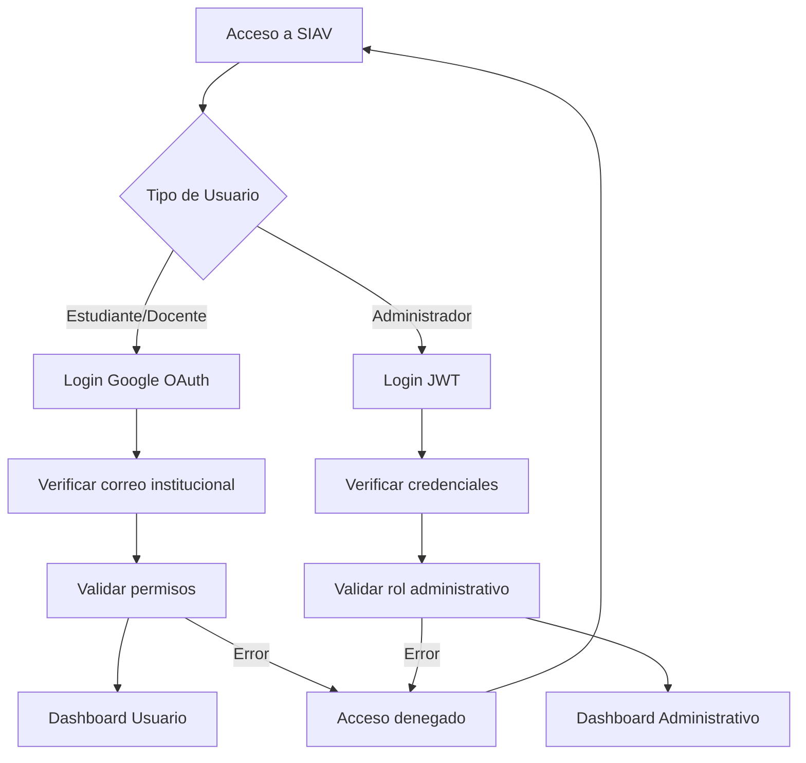
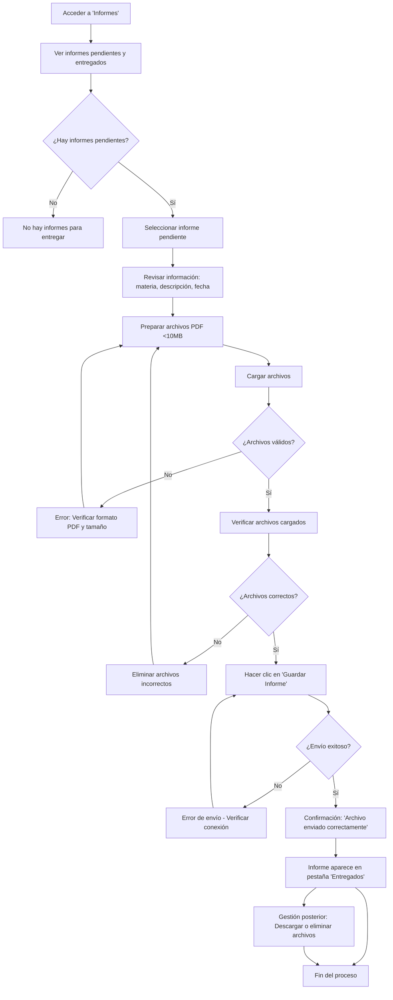
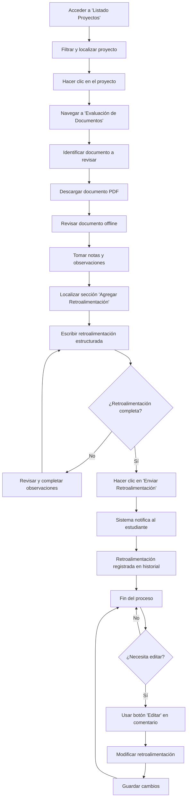
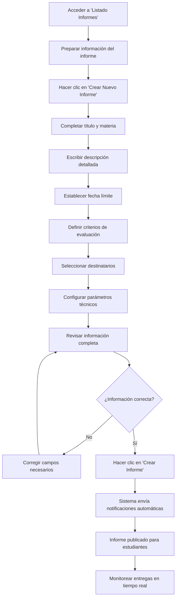
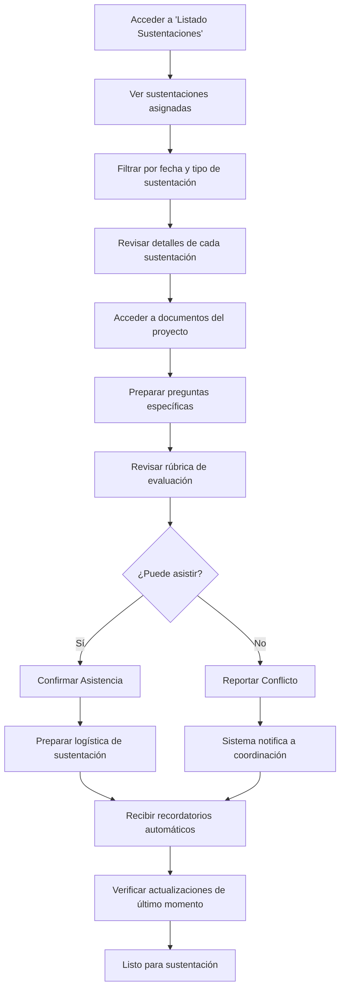

 # Manual de Usuario Final - SIAV
### Sistema de Información Académica Virtual
*Desarrollado en el marco de la Maestría en TIC aplicadas a la Educación*

---

## Introducción

Bienvenido al Sistema de Información Académica Virtual (SIAV), una plataforma integral diseñada para revolucionar la gestión académica universitaria mediante tecnologías modernas y procesos automatizados. Este manual ha sido diseñado específicamente para usuarios no técnicos, proporcionando una guía completa y accesible para navegar y aprovechar al máximo todas las funcionalidades del sistema.

### Propósito del Sistema

SIAV surge como respuesta a la necesidad de digitalizar y optimizar los procesos académicos tradicionales de la Maestría en TIC aplicadas a la Educación, ofreciendo una solución robusta que integra:

- **Gestión completa de proyectos de grado** con seguimiento en tiempo real
- **Evaluación y retroalimentación digitalizada** con trazabilidad
- **Reducción de la carga administrativa** mejorando la calidad de los datos y fortaleciendo la toma de decisiones basada en información estructurada

### Público Objetivo

- **Estudiantes de la Maestría en TIC Aplicadas a la Educación:**
  Son los principales usuarios del sistema en cuanto al registro de propuestas de trabajo de grado, entrega de avances, gestión de documentos y seguimiento de observaciones. El sistema está diseñado para ofrecerles una interfaz clara y trazabilidad de cada etapa del proceso investigativo.
  
- **Directores y Codirectores de Trabajo de Grado:**
  Este grupo utiliza el sistema para validar propuestas, realizar seguimiento académico, registrar observaciones y aprobar hitos del proceso investigativo. La plataforma les proporciona un entorno organizado para gestionar múltiples estudiantes y mantener la trazabilidad de su labor docente.

- **Evaluadores Académicos:**
  Encargados de revisar y calificar los productos finales de investigación, emitir conceptos y recomendaciones. El sistema les permite acceder de forma estructurada a los documentos presentados y registrar sus respectivas evaluaciones.

- **Coordinadores del Programa de Maestría:**
  Son responsables de supervisar, aprobar, organizar y generar reportes sobre el estado de los trabajos de grado en curso.

- **Personal Administrativo Vinculado a la Gestión Académica:**
  Utiliza el sistema como herramienta de soporte para verificar el cumplimiento de los requisitos formales, gestionar actas, consolidar estadísticas y facilitar el flujo de información institucional.

---

## Requisitos del Sistema

### Especificaciones Técnicas Mínimas

**Hardware requerido:**
- **Procesador:** Intel Core i3 (3ra generación) o AMD Ryzen 3, o equivalente
- **Memoria RAM:** 4 GB mínimo (8 GB recomendado para mejor rendimiento)
- **Espacio en disco:** 1 GB disponible para archivos temporales y documentos
- **Resolución de pantalla:** 1366x768 píxeles mínimo (1920x1080 recomendado)

**Software y compatibilidad:**
- **Sistemas operativos compatibles:**
  - Windows 10 (versión 1903 o superior)
  - macOS 10.15 Catalina o superior
  - Linux Ubuntu 18.04 LTS o distribuciones equivalentes
  
- **Navegadores web compatibles:**
  - Google Chrome 90 o superior (recomendado)
  - Mozilla Firefox 88 o superior
  - Microsoft Edge 90 o superior
  - Safari 14 o superior (macOS)

**Conectividad y red:**
- **Conexión a internet:** Mínimo 5 Mbps de velocidad estable
- **Latencia:** Máximo 100ms para óptima experiencia
- **Puertos:** Acceso HTTP/HTTPS (80/443) sin restricciones de firewall

### Dependencias Externas

**Servicios integrados:**
- **Correo electrónico institucional** activo y configurado
- **Google OAuth 2.0** (para autenticación alternativa)

**Software adicional recomendado:**
- **Lector de PDF** actualizado (Adobe Reader, Foxit, etc.)
- **Suite ofimática** para edición de documentos (Microsoft Office, LibreOffice, Google Docs)
- **Aplicación de autenticación 2FA** (Google Authenticator, opcional)

---

## Instalación y Acceso

### Métodos de Acceso al Sistema

SIAV es una aplicación web que no requiere instalación local. El acceso se realiza exclusivamente a través de navegadores web desde cualquier dispositivo con conexión a internet.

#### Proceso de Acceso Inicial

**1. Acceso al sistema:**
   ```
   URL Principal: https://gitlab.applab.ufps.edu.co/
   URLs de Desarrollo: Consulte con su administrador
   ```

**2. Identificación del tipo de usuario:**
   SIAV maneja dos flujos de autenticación diferenciados:

 - **Para Estudiantes y Docentes (Autenticación Google OAuth):**
   - Utilice el botón "Iniciar sesión con Google"
   - Ingrese con su correo institucional @ufps.edu.co
   - El sistema validará automáticamente sus permisos

 - **Para Administradores (Autenticación JWT):**
   - Utilice el formulario de "https://gitlab.applab.ufps.edu.co/login-admin"
   - Ingrese usuario y contraseña

#### Diagrama de Flujo de Acceso



### Configuración Inicial y Seguridad

#### Primera Vez en el Sistema

**Para nuevos usuarios:**
1. **Validación de identidad:** El sistema verificará automáticamente su pertenencia institucional
2. **Asignación de roles:** Se establecerán permisos según su vinculación académica

#### Recomendaciones de Seguridad Críticas

**Gestión de credenciales:**
- **Nunca comparta** sus credenciales de acceso
- **Use contraseñas robustas** con mínimo 12 caracteres
- **Active autenticación 2FA** cuando esté disponible
- **Cambie contraseñas** cada 90 días

**Buenas prácticas de uso:**
- **Cierre sesión** al finalizar, especialmente en equipos compartidos
- **No deje sesiones abiertas** por más de 2 horas sin actividad
- **Verifique la URL** antes de ingresar credenciales
- **Reporte actividad sospechosa** inmediatamente

**Protección de datos:**
- **No guarde credenciales** en navegadores de equipos públicos
- **Use conexiones seguras** (HTTPS) exclusivamente
- **Mantenga actualizado** su navegador y sistema operativo

---

## Guía de Uso Detallada por Funcionalidades y Roles

### Arquitectura del Sistema y Navegación

SIAV está estructurado en módulos especializados que se adaptan dinámicamente según el rol del usuario. La interfaz utiliza un sistema de navegación lateral contextual que presenta únicamente las opciones relevantes para cada perfil de usuario.

<!-- #### Estructura General de Navegación (Gestión de Proyectos)

```
Dashboard Principal
├── Proyectos
   ├── Estado Proyecto
   ├── Seguimiento
   ├── Informes
   ├── Listado Informes
   ├── Listado Proyectos
   ├── Listado Sustentaciones
   ├── Proyectos
   └── Grupos Investigación
``` -->

---

## 1. PERFIL ESTUDIANTE

#### Estructura General de Navegación (Gestión de Proyectos)

```
Dashboard Principal
├── Proyectos
   ├── Estado Proyecto
   ├── Seguimiento
   └── Informes
```

### 1.1 Dashboard y Vista General

Al ingresar como estudiante, el dashboard presenta una vista consolidada de su progreso académico:

**Componentes principales:**
- **Fase Actual:** Progreso general del proyecto
- **Próxima Actividad:** Calendario de Actividades
- **Tareas Atrasadas:** Tareas pendientes con atrasos

### 1.2 Gestión de Proyectos de Grado

#### Ciclo de Vida del Proyecto (8 Fases)

El sistema maneja un flujo estructurado de 8 fases obligatorias:

- #### **Fase 1: Inicio del Proyecto**
  - **Objetivo:** Establecer los fundamentos conceptuales del proyecto de grado mediante la definición clara del título, problemática de investigación, objetivos y alineación con los objetivos de desarrollo sostenible, creando una base sólida para el desarrollo posterior del anteproyecto.

  - **Proceso paso a paso:**
      **1.** Acceda a **"Proyectos" → "Seguimiento"**
      **2.** Complete la información requerida:
      - Título del proyecto
      - Objetivos de desarrollo sostenible
      - Pregunta de investigación
      - Descripción del problema
      - Objetivo general
      - Objetivos específicos
  
      **3.** Guarde cambios
      **4.** Envíe a revisión
      **5.** **En caso de que el formulario sea rechazado:** Revise cuidadosamente las observaciones proporcionadas, realice las correcciones necesarias y vuelva a enviar a una nueva revisión.

  - **Diagrama de flujo (Fase 1):**
    ```mermaid
      graph TD
        A[Proyectos → Seguimiento] --> B[Diligenciar formulario con información de la idea del proyecto]
        B --> C[Guardar cambios]
        C --> D[Enviar a revisión]
        D --> E{¿Aprobado?}
        E -- Sí --> F[Proyecto aprobado para avanzar a siguiente fase]
        E -- No --> G[Revisar observaciones y corregir]
        G --> B
    ```
  
- #### **Fase 2: Presentación Inicial del Proyecto**
  - **Objetivo:** Definir la adscripción académica del proyecto mediante la selección del grupo y línea de investigación correspondiente, estableciendo el contexto investigativo específico y opcionalmente recomendando los directores académicos que orientarán el desarrollo del trabajo de grado.

  - **Proceso paso a paso:**
      **1.** Acceda a **"Proyectos" → "Seguimiento"**
      **2.** Complete la siguiente información en el formulario:
      - **Grupo de investigación:** Seleccione de la lista desplegable el grupo al que se adscribe su proyecto.
      - **Línea de investigación:** Elija la línea específica dentro del grupo seleccionada.
      - **Recomendar director (opcional):** Puede sugerir un docente para dirigir su proyecto. Si no lo hace será asignado por un administrador.
      - **Recomendar codirector (opcional):** Puede sugerir un codirector especializado si lo considera pertinente. Si no lo hace será asignado por un administrador.

      **3.** Guarde cambios
      **4.** Envíe a revisión
      **5.** **En caso de que el formulario sea rechazado:** Revise cuidadosamente las observaciones proporcionadas, realice las correcciones necesarias y vuelva a enviar a una nueva revisión.

  - **Diagrama de flujo (Fase 2):**
    ```mermaid
      graph TD
        A[Proyectos → Seguimiento] --> B[Adscribirse a un grupo de investigación y a una línea de investigación]
        B --> C[Opcionalmente recomendar Director y Codirector]
        C --> D[Guardar cambios]
        D --> E[Enviar a revisión]
        E --> F{¿Aprobado?}
        F -- Sí --> G[Proyecto aprobado para avanzar a siguiente fase]
        F -- No --> H[Revisar observaciones y corregir]
        H --> B
    ```

- #### **Fase 3: Primera Entrega del Anteproyecto**
  - **Objetivo:** Preparar y presentar formalmente el documento del anteproyecto junto con su presentación correspondiente para evaluación de los directores asignados, obteniendo retroalimentación especializada que permita refinar la propuesta investigativa antes de proceder a la sustentación formal ante jurados académicos.

  - **Proceso paso a paso:**
    **1.** Acceda a **"Proyectos" → "Seguimiento"**
    **2.** Suba los siguientes archivos:
    - **Documento del Anteproyecto (PDF):** Suba el archivo principal que contiene el desarrollo completo del anteproyecto, incluyendo la introducción, justificación, objetivos, marco teórico, metodología propuesta y cronograma. Este documento debe estar en formato PDF y cumplir con la estructura y extensión solicitada por el programa académico.
    - **Presentación del Anteproyecto (PDF):** Adjunte el archivo PDF con las diapositivas que utilizará para exponer el anteproyecto ante el comité o directores. La presentación debe resumir los puntos clave del documento, como el problema, objetivos, metodología y resultados esperados, y estar diseñada para una exposición oral clara y concisa.
    - **Carta de Solicitud de Evaluación del Anteproyecto (PDF):** Cuando haya subido los archivos requeridos, descargue la carta borrador, diligénciela con la información solicitada y cárguelo en formato PDF.

    **3.** Guarde cambios
    **4.** Envíe a revisión
    **5.** **En caso de que el formulario sea rechazado:** Revise cuidadosamente las observaciones proporcionadas, realice las correcciones necesarias y vuelva a enviar a una nueva revisión.

  - **Diagrama de flujo (Fase 3):**
    ```mermaid
      graph TD
        A[Proyectos → Seguimiento] --> B[Subir Documento y Presentación del anteproyecto en formato PDF]
        B --> C[Guardar cambios]
        C --> D{¿Los directores aprueban tu entrega sin observaciones pendientes?}
        D -- Sí --> F[Descargar la carta borrador, diligénciela con la información solicitada y cárguelo en formato PDF]
        D -- No --> B
        F --> G[Enviar a revisión]
        G --> H{¿Aprobado?}
        H -- Sí --> I[Proyecto aprobado para avanzar a siguiente fase]
        H -- No --> J[Revisar observaciones y corregir]
        J --> G
    ```

- #### **Fase 4: Sustentación del Anteproyecto**
  - **Objetivo:** Presentar formalmente el anteproyecto ante un jurado evaluador, defender la propuesta de investigación mediante exposición oral y implementar las correcciones o mejoras solicitadas para garantizar la calidad académica del proyecto antes de proceder a su desarrollo completo.

  - **Proceso paso a paso:**
    **1.** Acceda a **"Proyectos" → "Seguimiento"**.
    **2.** Consulte la información de la sustentación: fecha, hora y jurados asignados.
    **3.** Asista puntualmente a la sustentación según lo programado.
    **4.** Si los jurados solicitan correcciones:
    - Revise cuidadosamente las observaciones y sugerencias recibidas.
    - Realice los ajustes necesarios en su documento y/o presentación.
    - Suba los archivos corregidos en el sistema.

    **5.** Envíe los documentos corregidos a revisión.
    **6.** Si los archivos son rechazados nuevamente:
    - Revise las nuevas observaciones.
    - Realice las correcciones adicionales requeridas y repita el envío hasta su aprobación.

  - **Diagrama de flujo (Fase 4):**
    ```mermaid
      graph TD
        A[Proyectos → Seguimiento] --> B[Consultar detalles de sustentación]
        B --> C[Asistir puntualmente a la sustentación]
        C --> D{¿Jurados solicitan correcciones?}
        D -- No --> E[Proyecto avanza a siguiente fase]
        D -- Sí --> F[Revisar observaciones y sugerencias]
        F --> G[Realizar ajustes en documento/presentación]
        G --> H[Subir archivos corregidos al sistema]
        H --> I[Enviar documentos corregidos a revisión]
        I --> J{¿Aprobado?}
        J -- Sí --> E
        J -- No --> F
    ```

- #### **Fase 5: Planificación de Hitos del Proyecto**
  - **Objetivo:** Establecer un cronograma detallado con fechas específicas de inicio y finalización para cada objetivo del proyecto, garantizando una planificación temporal coherente que permita el seguimiento sistemático del progreso y asegure el cumplimiento de metas dentro de los plazos establecidos.

  - **Proceso paso a paso:**
    **1.** Acceda a **"Proyectos" → "Seguimiento"**.
    **2.** Para cada objetivo específico, debes establecer las siguientes fechas:
    - **Fecha de inicio:** Indica cuándo planeas comenzar el desarrollo de ese objetivo.
    - **Fecha de finalización:** Señala la fecha estimada para completar ese objetivo específico.

    **5.** Envíe a revisión.
    **6.** **En caso de que el formulario sea rechazado:** Revise cuidadosamente las observaciones proporcionadas, realice las correcciones necesarias y vuelva a enviar a una nueva revisión.

  - **Diagrama de flujo (Fase 5):**
    ```mermaid
      graph TD
        A[Proyectos → Seguimiento] --> B[Definir fechas de inicio y fin para cada objetivo específico]
        B --> C[Revisar coherencia de fechas y cronograma]
        C --> D[Guardar cambios]
        D --> E[Enviar a revisión]
        E --> F{¿Aprobado?}
        F -- Sí --> G[Proyecto avanza a siguiente fase]
        F -- No --> H[Revisar observaciones y corregir]
        H --> B
    ```

- #### **Fase 6: Seguimiento de Hitos**
  - **Objetivo:** En esta fase, se debe registrar el cumplimiento total de cada hito del proyecto, asegurando que tanto el director como el codirector hayan validado cada uno y que los documentos requeridos estén adjuntados correctamente. Para enviar el proyecto a revisión, es indispensable que todos los hitos estén finalizados y validados, y que el acta de visto bueno del anteproyecto esté cargada en el sistema. Antes de continuar, verifica que toda la información y los archivos estén actualizados y completos.


  - **Proceso paso a paso:**
    **1.** Acceda a **"Proyectos" → "Seguimiento"**.
    **2.** Para cada objetivo específico, marque el avance como completado al 100% una vez finalizado y adjunte el documento que respalde su cumplimiento.
    **3.** Cuando haya finalizado todos los objetivos y adjuntado los documentos correspondientes, notifique a sus directores para que validen su progreso.
    **4.** **Si algún director rechaza un objetivo:** revise las observaciones, corrija el documento de respaldo y vuelva a notificar al director para una nueva validación.
    **5.** Una vez que todos los objetivos estén validados al 100% por sus directores, solicite que adjunten el acta de visto bueno que certifica la finalización del desarrollo del proyecto.
    **5.** Envíe a revisión.
    **6.** **En caso de que el formulario sea rechazado:** Revise cuidadosamente las observaciones proporcionadas, realice las correcciones necesarias y vuelva a enviar a una nueva revisión.

  - **Diagrama de flujo (Fase 6):**
    ```mermaid
      graph TD
        A[Proyectos → Seguimiento] --> B[Marcar objetivos específicos como completados al 100%]
        B --> C[Adjuntar documentos de respaldo para cada objetivo]
        C --> D[Notificar a directores para validación]
        D --> E{¿Todos los directores aprueban todos los objetivos?}
        E -- No --> F[Revisar observaciones y corregir documentos]
        F --> G[Volver a notificar al director para nueva validación]
        G --> E
        E -- Sí --> H[Solicitar a directores que adjunten acta de visto bueno]
        H --> I[Enviar a revisión]
        I --> J{¿Aprobado?}
        J -- Sí --> K[Proyecto avanza a siguiente fase]
        J -- No --> L[Revisar observaciones y corregir]
        L --> I
    ```

- #### **Fase 7: Entrega de Documentos Finales**
  - **Objetivo:** Presentar la documentación final del proyecto de grado mediante la entrega de tres documentos esenciales: el documento final que consolida toda la investigación desarrollada, el artículo académico derivado del proyecto, y la presentación preparada para la sustentación oral, garantizando que todos los productos cumplan con los estándares de calidad académica requeridos para proceder a la evaluación final.

  - **Proceso paso a paso:**
    **1.** Acceda a **"Proyectos" → "Seguimiento"**
    **2.** Suba los siguientes archivos:
    - **Documento Final (PDF):** Suba el documento completo del proyecto de grado que incluye todos los capítulos desarrollados: introducción, marco teórico, metodología, desarrollo del proyecto, resultados, conclusiones, recomendaciones y bibliografía. Este documento debe representar la versión definitiva de la investigación, incorporando todas las correcciones y mejoras realizadas durante el proceso de seguimiento de hitos. Debe cumplir con la estructura, formato y extensión establecidos por el programa académico.
    - **Artículo (PDF):** Adjunte el artículo académico derivado del proyecto de grado, que sintetiza los aspectos más relevantes de la investigación en formato de publicación científica. El artículo debe incluir resumen, palabras clave, introducción, metodología, resultados, discusión, conclusiones y referencias bibliográficas, siguiendo las normas de redacción académica establecidas y con una extensión apropiada para su potencial publicación.
    - **Presentación (PDF):** Cargue la presentación en formato PDF que utilizará durante la sustentación oral del proyecto. Esta debe resumir de manera clara y concisa los puntos clave del proyecto: problema de investigación, objetivos, metodología, principales resultados, conclusiones y recomendaciones. La presentación debe estar diseñada para una exposición oral efectiva, con diapositivas visualmente atractivas y contenido apropiado para el tiempo asignado en la sustentación.

    **3.** Guarde cambios
    **4.** Envíe a revisión
    **5.** **En caso de que los documentos sean rechazados:** Revise cuidadosamente las observaciones proporcionadas, realice las correcciones necesarias y vuelva a enviar a una nueva revisión.

  - **Diagrama de flujo (Fase 7):**
    ```mermaid
      graph TD
        A[Proyectos → Seguimiento] --> B[Subir Documento Final PDF]
        B --> C[Subir Artículo PDF]
        C --> D[Subir Presentación PDF]
        D --> E[Guardar cambios]
        E --> F[Enviar a revisión]
        F --> G{¿Documentos aprobados?}
        G -- Sí --> H[Proyecto aprobado para avanzar a siguiente fase]
        G -- No --> I[Revisar observaciones y corregir documentos]
        I --> F
    ```

- #### **Fase 8: Sustentación Final del Proyecto**
  - **Objetivo:** Realizar la defensa oral del proyecto de grado ante el jurado evaluador asignado, presentando formalmente los resultados de la investigación desarrollada. En caso de que los jurados soliciten correcciones posteriores a la sustentación, el estudiante debe implementar los ajustes requeridos en la documentación final y enviarlos a revisión hasta obtener la aprobación definitiva que certifique la culminación exitosa del proyecto de grado.

  - **Proceso paso a paso:**
    **1.** Acceda a **"Proyectos" → "Seguimiento"**.
    **2.** Consulte la información de la sustentación: fecha, hora y jurados asignados.
    **3.** Asista puntualmente a la sustentación según lo programado.
    **4.** Si los jurados solicitan correcciones:
    - Revise cuidadosamente las observaciones y sugerencias recibidas.
    - Realice los ajustes necesarios en sus documentos.
    - Suba los archivos corregidos en el sistema.

    **5.** Envíe los documentos corregidos a revisión.
    **6.** Si los archivos son rechazados nuevamente:
    - Revise las nuevas observaciones.
    - Realice las correcciones adicionales requeridas y repita el envío hasta su aprobación.

  - **Diagrama de flujo (Fase 8):**
    ```mermaid
      graph TD
        A[Proyectos → Seguimiento] --> B[Consultar detalles de sustentación final]
        B --> C[Asistir puntualmente a la sustentación]
        C --> D{¿Jurados solicitan correcciones?}
        D -- No --> E[Proyecto finalizado exitosamente]
        D -- Sí --> F[Revisar observaciones y sugerencias]
        F --> G[Realizar ajustes en documentos finales]
        G --> H[Subir archivos corregidos al sistema]
        H --> I[Enviar documentos corregidos a revisión]
        I --> J{¿Aprobado?}
        J -- Sí --> E
        J -- No --> F
    ```


#### Gestión de Documentos y Entregas

**Tipos de archivos permitidos:**
- Documentos principales: PDF únicamente
- Anexos: PDF, DOCX, XLSX (casos especiales)
- Presentaciones: PDF (para sustentaciones)
- Tamaño máximo: 25MB por archivo

**Proceso de carga de documentos:**
1. Seleccione la fase correspondiente
2. Haga clic en "Subir Documento"
3. Arrastre el archivo o use "Examinar"
4. Verifique información del archivo:
   - Nombre descriptivo
   - Versión del documento
   - Comentarios adicionales
5. Confirme la carga

### 1.3 Seguimiento y Retroalimentación

#### Sistema de Comentarios y Observaciones

Los directores pueden proporcionar tres tipos de retroalimentación:

**1. Comentarios Generales:**
- Observaciones sobre estructura y contenido
- Sugerencias de mejora
- Felicitaciones por avances

**2. Comentarios Específicos:**
- Señalamientos puntuales en secciones del documento
- Correcciones técnicas
- Solicitudes de ampliación o modificación

**3. Decisiones de Fase:**
- **Aprobado:** Avance a siguiente fase
- **Rechazado:** Solicitud de una nueva entrega con las correcciones solicitadas

### 1.4 Informes

Los informes son entregas de tareas asignadas por los docentes con fechas específicas. Los estudiantes deben completar y entregar estos informes dentro del plazo establecido.

#### Proceso de Entrega de Informes

**Proceso paso a paso:**

**1.** Acceda a **"Informes"** desde el menú lateral del sistema.

**2.** **Visualización de informes:**
- El sistema muestra dos pestañas: **"Pendientes"** e **"Entregados"**
- Los informes pendientes aparecen marcados con estado "Informe Pendiente" (rojo)
- Los informes entregados aparecen marcados con estado "Informe Entregado" (verde)

**3.** **Selección del informe a entregar:**
- Identifique el informe pendiente que desea entregar
- Revise la información del informe: materia, descripción y fecha límite

**4.** **Preparación de archivos:**
- Prepare sus documentos en formato PDF únicamente
- Cada archivo no debe superar los 10MB de tamaño
- Asegúrese de que los documentos estén completos y sean la versión final

**5.** **Carga de archivos:**
- En la sección "Archivos Adjuntos" del informe correspondiente:
  - **Opción A:** Haga clic en el área de carga para seleccionar archivos desde su computador
  - **Opción B:** Arrastre los archivos PDF directamente al área de carga
- El sistema validará automáticamente que sean archivos PDF y que no excedan el tamaño máximo

**6.** **Verificación de archivos:**
- Revise que todos los archivos se hayan cargado correctamente
- Verifique los nombres y tamaños de los archivos mostrados
- Si necesita eliminar algún archivo, use el botón "X" junto al nombre del archivo

**7.** **Envío del informe:**
- Haga clic en el botón **"Guardar Informe"**
- El sistema procesará la entrega y mostrará el mensaje "Archivo enviado correctamente"
- El estado del informe cambiará automáticamente a "Entregado"

**8.** **Confirmación y gestión posterior:**
- El informe aparecerá ahora en la pestaña "Entregados"
- Podrá descargar los archivos entregados usando el botón "Descargar"
- Si es necesario, podrá eliminar archivos individuales y subir nuevas versiones

**En caso de errores:**
- Si aparece el mensaje "Error al enviar el archivo", verifique su conexión a internet y vuelva a intentar
- Si los archivos no se cargan, confirme que sean formato PDF y no excedan 10MB
- Para problemas persistentes, contacte al administrador del sistema

#### Diagrama de Flujo - Entrega de Informes



**Casos de Uso Reales - Estudiante:**

**Caso 1: María, estudiante de Ingeniería de Sistemas**
María necesita subir su primer avance de proyecto sobre "Desarrollo de una aplicación móvil para gestión de inventarios".

*Proceso:*
1. Accede a SIAV usando su correo institucional
2. Ve en su dashboard que está en "Fase 4: Primer Avance"
3. Descarga la plantilla y completa su avance (23 páginas)
4. Sube el documento PDF de 3.2MB
5. Añade comentarios: "Incluye prototipo funcional y pruebas iniciales"
6. Su director recibe notificación automática
7. En 3 días recibe retroalimentación: "Excelente progreso, considere ampliar la sección de pruebas de usabilidad"

**Caso 2: Carlos, estudiante de posgrado**
Carlos está en fase de sustentación y necesita programar su defensa.

*Proceso:*
1. Accede a "Sustentaciones" en su menú lateral
2. Ve que su documento final fue aprobado
3. Sistema muestra fechas disponibles para sustentación
4. Selecciona fecha preferida y justifica en comentarios
5. Coordinación académica confirma fecha y jurados
6. Recibe calendario con detalles de sala, horario y requerimientos técnicos

#### Casos de Uso Específicos por Funcionalidad

##### Seguimiento de Fases del Proyecto

**Caso Frecuente: Laura, Fase 3 - Primera Entrega del Anteproyecto**
Laura es estudiante de segundo semestre y debe entregar su anteproyecto por primera vez.

*Situación:*
Laura ha completado las fases 1 y 2 de su proyecto sobre "Implementación de realidad aumentada en procesos educativos" y ahora debe hacer la primera entrega formal de su anteproyecto.

*Proceso:*
1. Accede a "Proyectos" → "Seguimiento" y ve que está en Fase 3
2. Revisa los requisitos: documento del anteproyecto, presentación, y carta de solicitud
3. Sube su documento del anteproyecto (45 páginas, 4.2MB) en PDF
4. Adjunta su presentación PowerPoint convertida a PDF (15 diapositivas)
5. Sus directores Dr. Martínez y Dra. López revisan en 4 días
6. Recibe retroalimentación: "Fortalecer marco metodológico, ajustar cronograma"
7. Hace correcciones durante una semana
8. Reenvía documentos corregidos
9. Directores aprueban sin observaciones
10. Descarga carta borrador, la diligencia y la sube al sistema
11. Envía a revisión final y es aprobada para avanzar a Fase 4

*Tiempo total del proceso:* 18 días

**Caso Borde: Miguel, Fase 6 - Problemas con Validación de Hitos**
Miguel está en la fase de seguimiento de hitos pero enfrenta dificultades con la validación de sus directores.

*Situación:*
Miguel tiene 4 objetivos específicos, ha completado 3 al 100% pero el 4to objetivo fue rechazado dos veces por su codirectora, mientras que su director principal está de viaje académico.

*Proceso problemático:*
1. Accede a "Proyectos" → "Seguimiento" y ve Fase 6 activa
2. Marca objetivos 1, 2 y 3 como completados (100%) con documentos adjuntos
3. Su director Dr. Ramírez los valida rápidamente 
4. Marca objetivo 4 como completado y adjunta documento de 28 páginas
5. Su codirectora Dra. Fernández lo rechaza: "Falta análisis estadístico"
6. Miguel corrige y reenvía, pero es rechazado nuevamente: "Metodología insuficiente"
7. Su director principal está en congreso internacional, no puede validar
8. Miguel solicita reunión virtual con ambos directores
9. En la reunión aclaran que necesita reestructurar completamente la metodología del objetivo 4
10. Miguel trabaja 3 semanas adicionales con asesoría de un experto externo
11. Reenvía documento completamente reestructurado (35 páginas)
12. Ambos directores finalmente aprueban todos los objetivos
13. Solicita acta de visto bueno que llega 5 días después
14. Envía fase a revisión y es aprobada con 6 semanas de retraso total

*Tiempo total del proceso:* 2.5 meses (esperado: 3 semanas)

##### Sustentación del Proyecto

**Caso Frecuente: Ana, Sustentación Final (Fase 8)**
Ana va a presentar su proyecto sobre "Análisis de sentiment en redes sociales educativas" en sustentación final.

*Situación:*
Ana completó exitosamente todas las fases anteriores y ha sido programada para sustentación final con jurado completo.

*Proceso:*
1. Accede a "Proyectos" → "Seguimiento" y ve información de sustentación:
   - Fecha: 15 de noviembre, 10:00 AM
   - Jurados: Dr. García (Presidente), Dra. Morales (Interno), Dr. Silva (Externo)
   - Sala: Aula Magna 201
2. Prepara presentación de 20 minutos según requisitos
3. Llega 30 minutos antes para verificar equipos audiovisuales
4. Presenta su proyecto durante 20 minutos sin interrupciones
5. Sesión de preguntas de 15 minutos:
   - Dr. García pregunta sobre escalabilidad del algoritmo
   - Dra. Morales consulta sobre validación de resultados
   - Dr. Silva cuestiona sobre aplicaciones futuras
6. Ana responde satisfactoriamente todas las preguntas
7. Jurados deliberan 10 minutos
8. Resultado: Aprobado con calificación 4.7/5.0
9. Recibe felicitaciones y sugerencias para publicación
10. Sistema genera automáticamente acta de sustentación
11. Ana accede al sistema y ve su proyecto marcado como "Finalizado Exitosamente"

*Tiempo total del proceso:* 1 hora 30 minutos

**Caso Borde: Roberto, Sustentación con Correcciones Mayores**
Roberto presenta su proyecto pero recibe solicitud de correcciones significativas post-sustentación.

*Situación:*
Roberto presenta su proyecto sobre "Blockchain en sistemas educativos" pero los jurados identifican deficiencias importantes que requieren correcciones sustanciales.

*Proceso problemático:*
1. Accede a información de sustentación programada para 9:00 AM
2. Presenta su proyecto pero durante la exposición:
   - Tiene dificultades técnicas con la demostración del prototipo
   - No puede responder claramente pregunta sobre seguridad de datos
   - Su metodología muestra inconsistencias estadísticas
3. Sesión de preguntas se extiende a 30 minutos con cuestionamientos intensos
4. Jurados deliberan 25 minutos (más de lo normal)
5. Resultado: "Aprobado condicionalmente - Requiere correcciones mayores"
6. Observaciones específicas:
   - Rehacer análisis de seguridad completo
   - Corregir metodología estadística con asesoría especializada
   - Reestructurar capítulo de resultados
   - Hacer prototipo completamente funcional
7. Roberto tiene 4 semanas para correcciones
8. Trabaja intensivamente con asesoría de 2 expertos externos
9. Reenvía documentos corregidos: documento final (ahora 89 páginas vs 67 originales)
10. Directores revisan y aprueban en 1 semana
11. Coordinación académica valida correcciones en 3 días
12. Sistema actualiza estado a "Finalizado con Correcciones"
13. Roberto debe presentar demostración del prototipo corregido en sesión adicional
14. Sustentación adicional de 30 minutos para validar correcciones
15. Aprobación final con calificación 4.2/5.0

*Tiempo total del proceso:* 7 semanas (esperado: 2 horas)

##### Entrega de Informes

**Caso Frecuente: Patricia, Entrega de Informe de Metodología**
Patricia debe entregar un informe de avance de metodología para la materia "Diseño de Investigación".

*Situación:*
La profesora Dra. Vásquez asignó un informe sobre metodología cuantitativa que debe entregarse antes del viernes a las 11:59 PM.

*Proceso:*
1. Patricia accede a "Informes" el jueves por la tarde
2. Ve en la pestaña "Pendientes" el informe:
   - Materia: Diseño de Investigación
   - Descripción: "Informe de metodología cuantitativa con análisis de variables"
   - Fecha límite: Viernes 11:59 PM
3. Revisa sus documentos preparados durante la semana:
   - Documento principal (12 páginas, 2.1MB)
   - Anexo con tablas estadísticas (8 páginas, 1.8MB)
4. Arrastra ambos archivos PDF al área de carga
5. Sistema valida formato y tamaño automáticamente
6. Ve vista previa de archivos cargados con nombres y tamaños
7. Hace clic en "Guardar Informe" a las 8:30 PM del jueves
8. Recibe confirmación: "Archivo enviado correctamente"
9. Informe aparece en pestaña "Entregados" con estado verde
10. Al día siguiente puede descargar sus archivos para verificar que se subieron correctamente

*Tiempo total del proceso:* 15 minutos

**Caso Borde: Fernando, Problemas Técnicos en Último Momento**
Fernando intenta entregar su informe pero enfrenta múltiples problemas técnicos justo antes de la fecha límite.

*Situación:*
Fernando está intentando entregar su informe de "Análisis de Datos Educativos" el domingo a las 10:45 PM (fecha límite: 11:59 PM) pero experimenta varios problemas técnicos consecutivos.

*Proceso problemático:*
1. Fernando accede a "Informes" a las 10:45 PM del domingo
2. Intenta cargar su documento principal pero:
   - Primer intento: Error - archivo de 12.5MB (excede límite de 10MB)
   - Optimiza PDF y reduce a 9.8MB
3. Segundo intento: Error de conexión (WiFi inestable en residencia estudiantil)
   - Cambia a datos móviles de su celular
4. Tercer intento a las 11:15 PM: Archivo se carga pero no ve confirmación
   - Página se queda "cargando" por 10 minutos
5. Pánico: Son las 11:25 PM, actualiza página y archivo no aparece cargado
6. Cuarto intento usando navegador diferente (Chrome en lugar de Firefox)
   - Funciona pero es lento
7. A las 11:35 PM logra cargar archivo principal
8. Intenta cargar anexos pero sistema muestra "Sesión expirada"
9. Reinicia sesión rápidamente (11:45 PM)
10. Carga anexos exitosamente
11. Hace clic en "Guardar Informe" a las 11:52 PM
12. Sistema procesa lentamente, confirmación llega a las 11:57 PM
13. Fernando toma capturas de pantalla como evidencia de entrega a tiempo
14. Al día siguiente verifica que todo se guardó correctamente
15. Contacta profesora por email explicando las dificultades técnicas con evidencias

*Tiempo total del proceso:* 1 hora 12 minutos de estrés intenso (esperado: 10 minutos)

---

## 2. PERFIL DOCENTE

#### Estructura General de Navegación (Gestión de Proyectos)

```
Dashboard Principal
├── Proyectos
   ├── Listado Informes
   ├── Listado Proyectos
   └── Listado Sustentaciones
```

### 2.1 Dashboard Docente

El dashboard docente presenta una vista gerencial de todas sus responsabilidades académicas:

**Componentes principales:**
- **Proyectos dirigidos activos** con estado de cada estudiante
- **Tareas de revisión pendientes** priorizadas por antigüedad
- **Calendario de reuniones** y sustentaciones programadas
- **Métricas de rendimiento** de estudiantes dirigidos
- **Notificaciones de sistema** y comunicaciones institucionales

### 2.2 Gestión de Proyectos Dirigidos

#### Asignación y Seguimiento

**Tipos de roles docentes:**
- **Director:** Responsabilidad principal del proyecto
- **Codirector:** Apoyo especializado en área específica
- **Jurado:** Evaluador en sustentación final

#### Participación del Docente en las Fases del Proyecto

El docente tiene roles específicos en diferentes fases del ciclo de vida del proyecto estudiantil:

##### **Fases con Participación Directa del Docente:**

**Fase 3: Primera Entrega del Anteproyecto**
- **Rol:** Revisor principal
- **Responsabilidades:**
  - Evaluar documento del anteproyecto en profundidad
  - Revisar presentación y carta de solicitud
  - Proporcionar retroalimentación técnica y metodológica detallada
- **Acción requerida:** Aprobar documentos o solicitar correcciones específicas

**Fase 4: Sustentación del Anteproyecto**
- **Rol:** Participante en comité evaluador
- **Responsabilidades:**
  - Asistir a la sustentación oral
  - Evaluar la defensa del anteproyecto
  - Determinar correcciones post-sustentación si es necesario
- **Acción requerida:** Calificar sustentación y aprobar o solicitar correcciones

**Fase 5: Planificación de Hitos del Proyecto**
- **Rol:** Asesor metodológico
- **Responsabilidades:**
  - Revisar cronograma propuesto
  - Validar factibilidad de fechas y objetivos
  - Sugerir ajustes en planificación temporal
- **Acción requerida:** Aprobar cronograma o solicitar modificaciones

**Fase 6: Seguimiento de Hitos**
- **Rol:** Supervisor activo
- **Responsabilidades:**
  - Validar cumplimiento de cada objetivo específico
  - Revisar documentos de respaldo de cada hito
  - Proporcionar el acta de visto bueno al completar todos los objetivos
- **Acción requerida:** Validar objetivos individualmente y emitir acta de visto bueno

**Fase 7: Entrega de Documentos Finales**
- **Rol:** Evaluador final
- **Responsabilidades:**
  - Revisar documento final, artículo y presentación
  - Validar calidad académica antes de sustentación
  - Autorizar proceder a sustentación final
- **Acción requerida:** Aprobar documentos finales para sustentación

**Fase 8: Sustentación Final del Proyecto**
- **Rol:** Miembro del jurado (Director/Codirector) o Presidente
- **Responsabilidades:**
  - Participar en jurado de sustentación final
  - Evaluar defensa oral del proyecto
  - Calificar según rúbricas establecidas
- **Acción requerida:** Calificar sustentación final y aprobar proyecto

### 2.3 Proceso de Revisión y Retroalimentación de Documentos

#### Como Hacer Comentarios a un Documento de un Proyecto

**Proceso paso a paso:**

**1.** Acceda a **"Proyectos" → "Listado Proyectos"**

**2.** **Localizar el proyecto:**
- Use los filtros de búsqueda por nombre de estudiante o título de proyecto
- Filtre por grupo y línea de investigación si es necesario
- Identifique los proyectos que requieren su revisión (aparecen destacados)

**3.** **Acceder al proyecto:**
- Haga clic en el proyecto que desea revisar
- El sistema lo llevará a la vista detallada del proyecto

**4.** **Revisar documentos disponibles:**
- Navegue a la sección "Evaluación de Documentos"
- Vea los documentos organizados por tipo (ANTEPROYECTO, TESIS, etc.)
- Identifique documentos que requieren su retroalimentación

**5.** **Descargar y revisar documento:**
- Haga clic en "Descargar" para obtener el archivo PDF
- Revise el documento offline usando sus herramientas preferidas
- Tome notas detalladas de observaciones y sugerencias

**6.** **Ingresar retroalimentación:**
- En la sección del documento correspondiente, localice "Agregar Retroalimentación"
- Escriba su retroalimentación en el área de texto proporcionada
- Incluya observaciones específicas, sugerencias de mejora y recursos adicionales

**7.** **Estructurar la retroalimentación:**
- **Fortalezas:** Identifique aspectos positivos del trabajo
- **Observaciones:** Señale áreas específicas que requieren mejora
- **Sugerencias:** Proporcione recomendaciones concretas y recursos
- **Cronograma:** Establezca fechas claras para correcciones

**8.** **Enviar retroalimentación:**
- Haga clic en "Enviar Retroalimentación"
- El sistema notificará automáticamente al estudiante
- La retroalimentación quedará registrada en el historial del proyecto

**En caso de necesitar editar:**
- Use los botones de "Editar" o "Eliminar" junto a su retroalimentación
- Solo puede editar sus propios comentarios
- Los cambios se notificarán automáticamente al estudiante

#### Diagrama de Flujo - Comentarios a Documentos



### 2.4 Gestión de Informes Académicos

#### Como Crear un Informe

**Proceso paso a paso:**

**1.** Acceda a **"Proyectos" → "Listado Informes"**

**2.** **Preparar información del informe:**
- Defina claramente el objetivo del informe
- Establezca fecha límite de entrega
- Prepare descripción detallada de requerimientos
- Seleccione el grupo de estudiantes destinatarios

**3.** **Iniciar creación:**
- Haga clic en "Crear Nuevo Informe" o botón similar
- Seleccione el tipo de informe (metodológico, avance, revisión bibliográfica, etc.)

**4.** **Completar formulario de creación:**
- **Título del informe:** Nombre claro y descriptivo
- **Materia/Asignatura:** Seleccione de la lista desplegable
- **Descripción:** Detalle específico de lo que deben entregar los estudiantes
- **Fecha límite:** Establezca fecha y hora de vencimiento
- **Criterios de evaluación:** Especifique rúbrica o criterios de calificación
- **Recursos:** Adjunte plantillas, ejemplos o material de apoyo si es necesario

**5.** **Seleccionar destinatarios:**
- Seleccione grupo de investigación o línea específica
- Elija estudiantes individuales si aplica
- Confirme lista de destinatarios

**6.** **Configurar parámetros del informe:**
- **Formato de entrega:** PDF, DOCX, etc. (recomendado: PDF únicamente)
- **Tamaño máximo:** Especifique límite de archivo (máximo 25MB)
- **Número de archivos:** Permita uno o múltiples archivos según necesidad
- **Entrega tardía:** Configure si acepta entregas fuera de plazo

**7.** **Revisar y confirmar:**
- Verifique toda la información ingresada
- Revise lista de destinatarios
- Confirme fechas y criterios

**8.** **Crear y publicar informe:**
- Haga clic en "Crear Informe"
- El sistema enviará notificaciones automáticas a los estudiantes
- El informe aparecerá en el dashboard de estudiantes como "Pendiente"

**9.** **Seguimiento post-creación:**
- Monitoree entregas en tiempo real
- Reciba notificaciones cuando los estudiantes suban documentos
- Acceda a revisar entregas desde "Listado Informes"

#### Diagrama de Flujo - Creación de Informes



### 2.5 Gestión de Sustentaciones

#### Como Revisar Sustentaciones Asignadas

**Proceso paso a paso:**

**1.** Acceda a **"Proyectos" → "Listado Sustentaciones"**

**2.** **Vista general de sustentaciones:**
- El sistema muestra todas las sustentaciones donde participa como jurado
- Se distinguen por tipo: Anteproyecto o Final
- Se indica su rol: Director, Codirector, Jurado Interno, Jurado Externo, o Presidente

**3.** **Filtrar sustentaciones:**
- Use filtros por fecha (próximas, esta semana, este mes)
- Filtre por tipo de sustentación (Anteproyecto/Final)
- Filtre por su rol en la sustentación
- Busque por nombre de estudiante o título de proyecto

**4.** **Revisar detalles de cada sustentación:**
Para cada sustentación asignada, revise:
- **Información básica:** Estudiante, título del proyecto, fecha y hora
- **Tipo de sustentación:** Anteproyecto o Final
- **Su rol específico:** Director, Codirector, Jurado, o Presidente
- **Otros jurados:** Lista completa del comité evaluador
- **Sala asignada:** Ubicación física o enlace virtual
- **Estado:** Programada, En progreso, Completada

**5.** **Acceder a documentos del proyecto:**
- Haga clic en "Ver Proyecto" para acceder a los documentos
- Descargue y revise el documento a sustentar
- Revise historial de fases y retroalimentación previas
- Prepare preguntas específicas basadas en el contenido

**6.** **Preparación para la sustentación:**
- **Revisar rúbrica de evaluación:** Consulte criterios de calificación
- **Preparar preguntas:** Formule preguntas técnicas y metodológicas
- **Verificar disponibilidad:** Confirme asistencia en el sistema
- **Revisar logística:** Verifique hora, lugar y requerimientos técnicos

**7.** **Gestionar disponibilidad:**
- Confirme su asistencia haciendo clic en "Confirmar Asistencia"
- Si no puede asistir, use "Reportar Conflicto" con la debida anticipación
- El sistema notificará automáticamente a coordinación académica

**8.** **Seguimiento pre-sustentación:**
- Reciba recordatorios automáticos 24 horas antes
- Acceda a actualizaciones de último momento (cambios de sala, hora, etc.)
- Verifique si hay documentos adicionales o correcciones post-revisión

#### Diagrama de Flujo - Revisión de Sustentaciones



### 2.6 Programación y Coordinación de Sustentaciones

**Proceso de programación:**
1. **Recepción de solicitud:** El estudiante solicita fecha de sustentación
2. **Verificación de requisitos:** Sistema valida cumplimiento de fases
3. **Asignación de jurados:** Coordinación asigna jurados especializados
4. **Confirmación de disponibilidad:** Todos los jurados confirman asistencia
5. **Programación definitiva:** Sistema genera convocatoria oficial

**Roles en sustentaciones:**
- **Presidente del jurado:** Dirige la sesión y modera tiempos
- **Jurado interno:** Evaluador institucional especializado
- **Jurado externo:** Evaluador externo para validación independiente

#### Evaluación y Calificación

**Criterios de evaluación estandarizados:**
- **Contenido técnico (40%):** Calidad, profundidad, originalidad
- **Metodología (25%):** Rigor, coherencia, aplicabilidad
- **Presentación oral (20%):** Claridad, dominio, manejo de preguntas
- **Documento escrito (15%):** Redacción, formato, bibliografía

**Escala de calificación:**
- **Excelente (4.5-5.0):** Cumple excepcionalmente todos los criterios
- **Sobresaliente (4.0-4.4):** Supera expectativas en mayoría de criterios
- **Aceptable (3.0-3.9):** Cumple satisfactoriamente los requisitos mínimos
- **Insuficiente (0.0-2.9):** No cumple con estándares mínimos requeridos

### 2.7 Tipos de Retroalimentación

**1. Comentarios Generales:**
- Observaciones sobre estructura y contenido
- Sugerencias de mejora
- Felicitaciones por avances

**2. Comentarios Específicos:**
- Señalamientos puntuales en secciones del documento
- Correcciones técnicas
- Solicitudes de ampliación o modificación

**3. Decisiones de Fase:**
- **Aprobado:** Avance a siguiente fase
- **Rechazado:** Solicitud de una nueva entrega con las correcciones solicitadas

**Ejemplo de buena retroalimentación:**
```
Fortalezas:
- Excelente marco teórico con fuentes actualizadas
- Metodología bien estructurada y justificada
- Claridad en la redacción y presentación

Observaciones:
- Sección 3.2: Ampliar la discusión sobre limitaciones del estudio
- Figuras 5 y 6: Mejorar calidad de resolución
- Conclusiones: Conectar mejor con objetivos planteados

Recursos sugeridos:
- Smith, J. (2023). "Metodologías avanzadas en investigación"
- Consultar estándares IEEE para documentación técnica

Fecha sugerida para nueva entrega: 15 días a partir de esta retroalimentación
```

### 2.8 Comunicación con Estudiantes

#### Canales de Comunicación

**Dentro del sistema SIAV:**
- **Retroalimentación formal:** A través del sistema de comentarios en documentos
- **Mensajes del sistema:** Comunicaciones oficiales sobre cronogramas y requisitos

**Canales externos complementarios:**
- **Correo electrónico:** Para comunicación formal y documentación
- **Reuniones virtuales:** Microsoft Teams, Zoom, Google Meet
- **Mensajería instantánea:** WhatsApp para comunicaciones urgentes (uso discrecional)

#### Mejores Prácticas de Comunicación

**Tiempo de respuesta esperado:**
- **Retroalimentación a documentos:** 5-7 días hábiles máximo
- **Respuesta a consultas por email:** 24-48 horas
- **Confirmación de reuniones:** 24 horas de anticipación mínima
- **Revisión de urgencias académicas:** Mismo día cuando sea posible

**Estructura de retroalimentación efectiva:**
1. **Saludo y contexto:** Reconocer el trabajo entregado
2. **Fortalezas identificadas:** Destacar aspectos positivos específicos
3. **Observaciones técnicas:** Señalar áreas de mejora con fundamento
4. **Sugerencias constructivas:** Proporcionar recursos y direcciones claras
5. **Cronograma claro:** Establecer expectativas de tiempo para correcciones
6. **Disponibilidad:** Ofrecer canales para aclarar dudas

### 2.9 Gestión de Fases y Estados de Proyecto

#### Comprensión del Flujo de Fases

Como director de proyecto, es crucial entender en qué momento del proceso se encuentra cada estudiante:

**Fases donde su participación es CRÍTICA:**
- **Fase 3:** Primera revisión formal del anteproyecto
- **Fase 4:** Sustentación del anteproyecto (como parte del jurado)
- **Fase 6:** Validación de cumplimiento de objetivos específicos
- **Fase 7:** Revisión final antes de sustentación
- **Fase 8:** Sustentación final del proyecto

**Fases donde su participación es de REVISIÓN y SEGUIMIENTO:**
- **Fase 1:** Validación inicial de propuesta conceptual
- **Fase 2:** Confirmación de adscripción y disponibilidad
- **Fase 5:** Validación de cronograma de hitos

#### Estados de Proyecto y Acciones Docentes

**Estado: "Esperando revisión del director"**
- **Acción requerida:** Revisar documento entregado y proporcionar retroalimentación
- **Tiempo límite:** 7 días hábiles desde la entrega
- **Resultado esperado:** Aprobación o solicitud de correcciones específicas

**Estado: "En revisión"**
- **Acción requerida:** Completar proceso de revisión iniciado
- **Seguimiento:** Verificar que retroalimentación sea clara y accionable
- **Resultado esperado:** Decisión definitiva sobre aprobación

**Estado: "Correcciones solicitadas"**
- **Acción requerida:** Monitorear entrega de correcciones del estudiante
- **Seguimiento:** Estar disponible para aclarar dudas sobre observaciones
- **Resultado esperado:** Nueva versión que atienda las observaciones

**Estado: "Programado para sustentación"**
- **Acción requerida:** Prepararse para participar en sustentación como jurado
- **Seguimiento:** Confirmar disponibilidad y revisar material final
- **Resultado esperado:** Participación efectiva en evaluación

### 2.10 Casos de Uso Completos por Escenario

#### Escenario A: Inicio de Dirección de Proyecto

**Situación:** El Dr. Ramírez ha sido asignado como director del proyecto de Sandra sobre "Aplicación de blockchain en sistemas de votación estudiantil".

**Proceso completo de acompañamiento:**

**Semana 1-2: Encuentro inicial y alineación**
1. Sandra aparece en dashboard como "Nuevo proyecto asignado"
2. Dr. Ramírez agenda reunión inicial virtual para conocer mejor la propuesta
3. En la reunión virtual revisan:
   - Intereses específicos de Sandra en el tema
   - Experiencia previa de Sandra con blockchain
   - Recursos disponibles para el proyecto
   - Cronograma tentativo
4. Dr. Ramírez proporciona bibliografía inicial especializada
5. Acuerdan reuniones semanales los viernes a las 3:00 PM

**Semana 3-6: Desarrollo del anteproyecto**
1. Sandra trabaja en anteproyecto con asesoría semanal
2. Dr. Ramírez revisa borradores informales vía email
3. Proporciona retroalimentación continua sobre:
   - Enfoque técnico del blockchain seleccionado
   - Metodología de desarrollo de software
   - Consideraciones de seguridad específicas
4. Sandra incorpora sugerencias y refina documento

**Semana 7: Entrega formal del anteproyecto (Fase 3)**
1. Sandra sube anteproyecto al sistema SIAV
2. Dr. Ramírez recibe notificación automática
3. Descarga documento de 42 páginas para revisión formal
4. Dedica 4 horas a revisión detallada durante el fin de semana
5. Identifica fortalezas:
   - Marco teórico sólido sobre blockchain
   - Justificación clara del problema
   - Objetivos específicos bien definidos
6. Identifica observaciones:
   - Metodología de evaluación de seguridad incompleta
   - Falta análisis de normativas legales aplicables
   - Cronograma muy optimista para desarrollo
7. Ingresa retroalimentación estructurada en el sistema
8. Solicita nueva versión en 10 días

**Semana 8-9: Correcciones y segunda versión**
1. Sandra trabaja en correcciones basadas en retroalimentación
2. Consulta con Dr. Ramírez sobre normativas legales específicas
3. Dr. Ramírez la conecta con experto en derecho informático
4. Sandra entrega versión corregida
5. Dr. Ramírez revisa nuevamente (2 horas) y aprueba para sustentación

**Semana 10: Sustentación del anteproyecto (Fase 4)**
1. Sistema programa sustentación automáticamente
2. Dr. Ramírez participa como parte del jurado evaluador
3. Sustentación exitosa con calificación 4.2/5.0
4. Se aprueban objetivos específicos y cronograma ajustado

**Continuación del acompañamiento hasta finalización...**

#### Escenario B: Gestión de Múltiples Proyectos Simultáneos

**Situación:** La Dra. Fernández dirige 6 proyectos en diferentes fases y debe gestionar eficientemente su tiempo.

**Estrategia de gestión semanal:**

**Lunes: Planificación y priorización**
1. Revisa dashboard para identificar tareas críticas
2. Prioriza según:
   - Urgencia (fechas límite próximas)
   - Fase del proyecto (sustentaciones > revisiones finales > seguimiento)
   - Dificultad del estudiante (mayor atención a estudiantes con dificultades)
3. Agenda bloques de tiempo específicos para cada proyecto

**Martes-Miércoles: Revisiones intensivas**
1. Dedica 2-3 horas por día exclusivamente a revisar documentos
2. Usa técnica de revisión por lotes (todos los anteproyectos juntos, luego todos los avances)
3. Mantiene plantillas de retroalimentación para eficiencia
4. Registra tiempo dedicado a cada proyecto para balance

**Jueves: Comunicación y seguimiento**
1. Responde emails pendientes de estudiantes
2. Agenda reuniones necesarias para la siguiente semana
3. Revisa progreso de estudiantes que no han entregado recientemente
4. Contacta estudiantes con posibles retrasos

**Viernes: Gestión administrativa y planificación**
1. Actualiza registros personales de progreso por proyecto
2. Revisa calendario de sustentaciones próximas
3. Prepara material para reuniones de la siguiente semana
4. Planifica siguientes pasos con cada estudiante

**Resultados del proceso estructurado:**
- Tiempo promedio de respuesta: 3 días (vs 7 días sin estructura)
- Estudiantes más satisfechos con acompañamiento constante
- Menor estrés personal por mejor organización
- Mayor calidad en retroalimentación por dedicación focussed

#### Escenario C: Situación de Crisis - Proyecto con Problemas Serios

**Situación:** El proyecto de Miguel sobre "IA para diagnóstico médico" enfrenta problemas éticos y técnicos serios a 3 semanas de la sustentación final.

**Crisis identificada:**
- Problemas de privacidad de datos médicos no resueltos
- Algoritmo propuesto tiene sesgos identificables
- Documentación técnica incompleta
- Miguel está abrumado y considerando abandonar

**Plan de intervención de emergencia:**

**Semana 1: Evaluación y contención**
1. Dr. Sánchez programa reunión urgente presencial con Miguel
2. Identifica problemas específicos:
   - Falta aprobación del comité de ética para datos médicos
   - Dataset utilizado tiene sesgos demográficos
   - Documentación no cumple estándares de reproducibilidad
3. Evalúa opciones realistas:
   - Opción A: Cambiar a dataset público sin problemas éticos
   - Opción B: Redefinir alcance del proyecto a prototipo conceptual
   - Opción C: Solicitar extensión de plazo (última opción)
4. Miguel acepta Opción A con apoyo intensivo

**Semana 2: Replanteamiento acelerado**
1. Dr. Sánchez dedica 10 horas esa semana específicamente a Miguel
2. Identifica dataset público apropiado (UCI ML Repository)
3. Miguel re-entrena modelo con nuevos datos (48 horas de trabajo)
4. Dr. Sánchez revisa resultados cada 2 días
5. Coordinan con codirector para apoyo técnico adicional

**Semana 3: Finalización de emergencia**
1. Miguel completa documentación técnica con plantillas proporcionadas
2. Dr. Sánchez revisa versión preliminar en 24 horas (vs 7 días normal)
3. Se identifican problemas menores que Miguel corrige en 2 días
4. Versión final se aprueba 3 días antes de sustentación
5. Dr. Sánchez coordina sesión de práctica de sustentación

**Resultado:**
- Miguel sustenta exitosamente con calificación 3.8/5.0
- Proyecto redefinido es técnicamente sólido y éticamente apropiado
- Miguel recupera confianza y considerará estudios de posgrado
- Dr. Sánchez documenta lecciones aprendidas para futuros casos similares

### 2.11 Herramientas y Recursos para Docentes

#### Plantillas de Retroalimentación

**Plantilla para Anteproyectos:**
```
REVISIÓN DE ANTEPROYECTO
Estudiante: [Nombre]
Fecha de revisión: [Fecha]
Fase: [Número de fase]

FORTALEZAS IDENTIFICADAS:
- [Listar aspectos positivos específicos]
- [Incluir elementos bien desarrollados]
- [Reconocer esfuerzo y progreso]

OBSERVACIONES TÉCNICAS:
1. Marco Teórico:
   - [Comentarios específicos]
   - [Sugerencias de mejora]

2. Metodología:
   - [Observaciones sobre diseño metodológico]
   - [Validez y confiabilidad]

3. Objetivos y Alcance:
   - [Claridad y factibilidad]
   - [Alineación con recursos disponibles]

RECURSOS SUGERIDOS:
- [Bibliografía específica]
- [Herramientas técnicas]
- [Contactos especializados]

CRONOGRAMA SUGERIDO:
- Correcciones: [X días]
- Reunión de seguimiento: [Fecha]
- Nueva entrega: [Fecha]

DISPONIBILIDAD PARA CONSULTAS:
- [Horarios de oficina]
- [Canales de comunicación preferidos]
```

**Plantilla para Documentos Finales:**
```
REVISIÓN DE DOCUMENTO FINAL
Estudiante: [Nombre]
Proyecto: [Título]
Fecha de revisión: [Fecha]

EVALUACIÓN GENERAL:
Calidad técnica: [Excelente/Muy buena/Buena/Necesita mejora]
Rigurosidad metodológica: [Evaluación]
Claridad de presentación: [Evaluación]
Originalidad y aporte: [Evaluación]

REVISIÓN DETALLADA POR SECCIONES:
[Análisis específico por capítulo/sección]

PREPARACIÓN PARA SUSTENTACIÓN:
- Puntos fuertes a destacar en presentación
- Posibles preguntas de jurados
- Recomendaciones para defensa oral

DECISIÓN: [Aprobado/Aprobado con correcciones menores/Requiere correcciones mayores]
```

#### Recursos de Apoyo Académico

**Bibliografía especializada por área:**
- Bases de datos académicas institucionales
- Acceso a revistas científicas de alta calidad
- Repositorios de tesis y trabajos similares
- Estándares de documentación por disciplina

**Herramientas técnicas:**
- Software especializado por área de conocimiento
- Licencias institucionales de herramientas de desarrollo
- Acceso a laboratorios y equipos especializados
- Plataformas de simulación y modelado

#### Métricas de Seguimiento Personal

**Indicadores de efectividad docente:**
- Tiempo promedio de respuesta a estudiantes
- Porcentaje de proyectos finalizados a tiempo
- Calificación promedio de proyectos dirigidos
- Satisfacción estudiantil (cuando esté disponible)

**Herramientas de autoevaluación:**
- Registro personal de tiempo dedicado por proyecto
- Seguimiento de metodologías de retroalimentación más efectivas
- Identificación de áreas de especialización para mejor asesoría
- Planificación de desarrollo profesional continuo

---

## 3. PERFIL ADMINISTRADOR

#### Estructura General de Navegación (Gestión Académica)

```
Dashboard Principal
├── Proyectos
   ├── Listado Proyectos
   └── Grupos de Investigación
```

### 3.1 Dashboard y Vista General Administrativa

El administrador tiene acceso a una vista consolidada de todo el sistema académico con capacidades de supervisión y gestión avanzada:

**Componentes principales del dashboard:**
- **Vista Global de Proyectos:** Todos los proyectos en curso con filtros avanzados
- **Estados de Revisión:** Proyectos pendientes de validación por fase
- **Gestión de Directores:** Asignación y reasignación de directores/codirectores
- **Control de Fases:** Supervisión y control manual del avance de fases

### 3.2 Participación del Administrador en todas las Fases del Proyecto Estudiantil

El administrador tiene capacidades de supervisión y control en cada una de las 8 fases del proyecto estudiantil, actuando como ente regulador y facilitador del proceso académico.

#### Fase 1: Supervisión del Inicio del Proyecto

- **Objetivo:** Supervisar y validar la información inicial del proyecto estudiantil, asegurando que cumpla con los estándares académicos institucionales y proporcionando apoyo en caso de dificultades en la definición conceptual del proyecto.

- **Proceso paso a paso:**
      **1.** Acceda a **"Administración" → "Proyectos"**
      **2.** Filtre proyectos por **"Fase 1"** y estado **"En Revisión"**
      **3.** Seleccione el proyecto a revisar y haga clic en **"Revisar Fase"**
      **4.** El sistema abre el modal de revisión mostrando:
     - Título del proyecto completo
     - Pregunta de investigación planteada
     - Descripción del problema identificado
     - Objetivo general y objetivos específicos
     - Objetivos de Desarrollo Sostenible (ODS) seleccionados
  **5.** Evalúe la coherencia y calidad de la propuesta inicial
  **6.** Seleccione el estado de revisión:
     - **"Aprobar fase"** si cumple con los criterios de calidad
     - **"Rechazar fase"** si requiere mejoras significativas
  **7.** Si rechaza, proporcione comentarios específicos sobre:
     - Aspectos a mejorar en la formulación del problema
     - Sugerencias para el refinamiento de objetivos
     - Recomendaciones de alineación con ODS apropiados
  **8.** Confirme la validación
  **9.** El estudiante recibe notificación automática del estado y comentarios

- **Diagrama de flujo (Administrador - Fase 1):**
  ```mermaid
    graph TD
      A[Administración → Proyectos] --> B[Filtrar por Fase 1 y estado 'En Revisión']
      B --> C[Seleccionar proyecto]
      C --> D[Hacer clic en 'Revisar Fase']
      D --> E[Modal de revisión - Vista completa del formulario Fase 1]
      E --> F[Evaluar coherencia y calidad de la propuesta]
      F --> G{¿Cumple estándares académicos?}
      G -- Sí --> H[Seleccionar 'Aprobar fase']
      G -- No --> I[Seleccionar 'Rechazar fase']
      I --> J[Escribir comentarios específicos de mejora]
      J --> K[Confirmar validación]
      H --> K
      K --> L[Estudiante recibe notificación automática]
      L --> M[Fin del proceso administrativo]
  ```
  
#### Fase 2: Control de Adscripción Académica

- **Objetivo:** Supervisar la correcta adscripción del proyecto a grupos y líneas de investigación, así como gestionar la asignación definitiva de directores y codirectores cuando los estudiantes no han hecho recomendaciones o cuando es necesario realizar reasignaciones por disponibilidad académica.

- **Proceso paso a paso:**
      **1.** Acceda a **"Administración" → "Proyectos"** 
      **2.** Filtre proyectos por **"Fase 2"** y estado **"En Revisión"**
      **3.** Seleccione el proyecto y revise:
     - Grupo de investigación seleccionado por el estudiante
     - Línea de investigación escogida
     - Recomendaciones de director y codirector (si las hay)
  **4.** Valide la coherencia entre proyecto y línea de investigación
  **5.** Si el estudiante no recomendó directores o hay conflictos:
     - Haga clic en **"Asignar Directores"**
     - Seleccione director apropiado según expertise y disponibilidad
     - Asigne codirector complementario si es necesario
     - Confirme asignaciones
  **6.** Revise la fase:
     - **"Aprobar fase"** si la adscripción es apropiada
     - **"Rechazar fase"** si requiere cambios en grupo/línea
  **7.** Proporcione comentarios si es necesario
  **8.** Confirme la validación

- **Diagrama de flujo (Administrador - Fase 2):**
  ```mermaid
    graph TD
      A[Administración → Proyectos] --> B[Filtrar por Fase 2 y 'En Revisión']
      B --> C[Seleccionar proyecto]
      C --> D[Revisar adscripción y recomendaciones]
      D --> E{¿Coherencia proyecto-línea OK?}
      E -- No --> F[Rechazar fase con comentarios sobre adscripción]
      E -- Sí --> G{¿Estudiante recomendó directores?}
      G -- No --> H[Hacer clic en 'Asignar Directores']
      G -- Sí --> I[Validar disponibilidad y expertise de recomendados]
      H --> J[Seleccionar director según expertise]
      J --> K[Asignar codirector complementario]
      K --> L[Confirmar asignaciones]
      I --> M{¿Directores disponibles y apropiados?}
      M -- No --> H
      M -- Sí --> N[Aprobar fase]
      L --> N
      F --> O[Estudiante corrige y reenvía]
      N --> P[Notificación automática a estudiante y directores]
      P --> Q[Fin del proceso]
  ```

#### Fase 3: Control de Calidad del Anteproyecto

- **Objetivo:** Verificar que los documentos del anteproyecto cumplan con los estándares institucionales de calidad y formato, así como supervisar que el proceso de revisión por parte de los directores se complete correctamente antes de autorizar el avance a sustentación.

- **Proceso paso a paso:**
      **1.** Acceda a **"Administración" → "Proyectos"**
      **2.** Filtre por **"Fase 3"** y estado **"En Revisión"**
      **3.** Seleccione el proyecto para revisar:
     - Documento del anteproyecto (formato y estructura)
     - Presentación del anteproyecto (calidad visual)
     - Carta de solicitud de evaluación (completitud)
  **4.** Verifique que los directores hayan proporcionado retroalimentación
  **5.** Revise la calidad técnica de los documentos:
     - Cumplimiento de plantillas institucionales
     - Coherencia en estructura y contenido
     - Calidad de redacción y referencias
  **6.** Determine el estado:
     - **"Aprobar fase"** si todo está conforme
     - **"Rechazar fase"** si hay deficiencias importantes
  **7.** Si rechaza, especifique claramente:
     - Problemas de formato o estructura
     - Deficiencias de contenido académico
     - Requerimientos adicionales necesarios
  **8.** Confirme la validación

- **Diagrama de flujo (Administrador - Fase 3):**
  ```mermaid
    graph TD
      A[Administración → Proyectos] --> B[Filtrar por Fase 3 y 'En Revisión']
      B --> C[Seleccionar proyecto]
      C --> D[Revisar documentos cargados]
      D --> E{¿Documentos completos?}
      E -- No --> F[Rechazar - Solicitar documentos faltantes]
      E -- Sí --> G{¿Directores dieron retroalimentación?}
      G -- No --> H[Rechazar - Solicitar revisión de directores]
      G -- Sí --> I[Revisar calidad técnica de documentos]
      I --> J{¿Cumplen estándares institucionales?}
      J -- No --> K[Rechazar con comentarios específicos sobre deficiencias]
      J -- Sí --> L[Aprobar fase]
      F --> M[Estudiante completa documentos]
      H --> N[Directores revisan documentos]
      K --> O[Estudiante corrige deficiencias]
      M --> D
      N --> G
      O --> I
      L --> P[Proyecto listo para sustentación]
      P --> Q[Fin del proceso]
  ```

#### Fase 4: Supervisión de Sustentación del Anteproyecto

- **Objetivo:** Supervisar el proceso de sustentación del anteproyecto, gestionar la programación con jurados, administrar casos especiales durante la sustentación, y facilitar el procesamiento de correcciones post-sustentación cuando sean requeridas por los evaluadores.

- **Proceso paso a paso:**
      **1.** Acceda a **"Administración" → "Sustentaciones"**
      **2.** Programe la sustentación:
     - Asigne fecha y hora disponible
     - Seleccione jurados evaluadores apropiados
     - Reserve sala o espacio virtual
     - Configure criterios de evaluación
  **3.** Monitoree el día de la sustentación:
     - Verifique asistencia de jurados y estudiante
     - Facilite aspectos técnicos o logísticos
     - Registre observaciones del proceso
  **4.** Post-sustentación, revise resultados:
     - Califación otorgada por jurados
     - Observaciones y correcciones solicitadas
     - Estado de aprobación (directo o con correcciones)
  **5.** Si hay correcciones requeridas:
     - Supervise que el estudiante implemente cambios
     - Verifique calidad de las correcciones realizadas
     - Valide que directores aprueben las correcciones
  **6.** Cuando todo esté conforme:
     - **"Aprobar fase"** para avance a planificación
     - Genere acta de sustentación oficial

- **Diagrama de flujo (Administrador - Fase 4):**
  ```mermaid
    graph TD
      A[Administración → Sustentaciones] --> B[Programar sustentación del anteproyecto]
      B --> C[Asignar jurados evaluadores]
      C --> D[Reservar sala/configurar aspectos técnicos]
      D --> E[Día de sustentación]
      E --> F[Monitorear proceso de sustentación]
      F --> G{¿Sustentación exitosa?}
      G -- Problemas técnicos --> H[Reprogramar sustentación]
      H --> E
      G -- Exitosa --> I{¿Jurados requieren correcciones?}
      I -- No --> J[Aprobar fase directamente]
      I -- Sí --> K[Supervisar implementación de correcciones]
      K --> L{¿Correcciones implementadas correctamente?}
      L -- No --> M[Solicitar mejoras adicionales]
      M --> K
      L -- Sí --> N[Directores validan correcciones]
      N --> O{¿Directores aprueban?}
      O -- No --> M
      O -- Sí --> J
      J --> P[Generar acta de sustentación]
      P --> Q[Fin del proceso]
  ```

#### Fase 5: Validación de Planificación de Hitos

- **Objetivo:** Revisar y validar la planificación temporal propuesta por el estudiante para el desarrollo de sus objetivos específicos, asegurando que los cronogramas sean realistas, coherentes y factibles dentro del marco temporal del programa académico.

- **Proceso paso a paso:**
      **1.** Acceda a **"Administración" → "Proyectos"**
      **2.** Filtre por **"Fase 5"** y estado **"En Revisión"** 
      **3.** Seleccione el proyecto y revise la planificación:
     - Fechas de inicio y fin para cada objetivo específico
     - Coherencia temporal entre objetivos
     - Realismo de los plazos propuestos
     - Alineación con calendario académico
  **4.** Evalúe factibilidad:
     - Disponibilidad de recursos necesarios
     - Complejidad vs tiempo asignado
     - Secuencialidad lógica de actividades
     - Margen para imprevistos
  **5.** Revise coherencia con director/codirector disponibilidad
  **6.** Determine estado:
     - **"Aprobar fase"** si la planificación es realista
     - **"Rechazar fase"** si requiere ajustes temporales
  **7.** Si rechaza, proporcione comentarios sobre:
     - Objetivos con cronogramas irreales
     - Sugerencias de redistribución temporal
     - Recomendaciones de secuenciación
  **8.** Confirme la validación

- **Diagrama de flujo (Administrador - Fase 5):**
  ```mermaid
    graph TD
      A[Administración → Proyectos] --> B[Filtrar por Fase 5 y 'En Revisión']
      B --> C[Seleccionar proyecto]
      C --> D[Revisar planificación de fechas para objetivos]
      D --> E{¿Fechas coherentes entre sí?}
      E -- No --> F[Rechazar - Solicitar coherencia temporal]
      E -- Sí --> G{¿Plazos realistas para complejidad?}
      G -- No --> H[Rechazar - Sugerir redistribución temporal]
      G -- Sí --> I{¿Alineación con calendario académico OK?}
      I -- No --> J[Rechazar - Ajustar a fechas institucionales]
      I -- Sí --> K{¿Disponibilidad de directores compatible?}
      K -- No --> L[Rechazar - Coordinar con disponibilidad docente]
      K -- Sí --> M[Aprobar fase]
      F --> N[Estudiante ajusta secuencia temporal]
      H --> O[Estudiante redistribuye cargas de trabajo]
      J --> P[Estudiante alinea con calendario]
      L --> Q[Estudiante coordina con directores]
      N --> D
      O --> D
      P --> D
      Q --> D
      M --> R[Planificación aprobada - Inicio de desarrollo]
      R --> S[Fin del proceso]
  ```

#### Fase 6: Supervisión del Seguimiento de Hitos

- **Objetivo:** Supervisar el progreso real del desarrollo del proyecto, validar que los hitos reportados por el estudiante sean accurados, gestionar conflictos en evaluaciones entre directores, y asegurar que la documentación de respaldo sea apropiada antes de autorizar el avance a entrega final.

- **Proceso paso a paso:**
      **1.** Acceda a **"Administración" → "Proyectos"**
      **2.** Filtre por **"Fase 6"** y estado **"En Revisión"**
      **3.** Seleccione el proyecto y revise:
     - Progreso reportado por el estudiante (% de avance)
     - Documentos de respaldo por cada objetivo
     - Evaluaciones de director y codirector
     - Presencia del acta de visto bueno
  **4.** Valide coherencia de avances:
     - Compare documentos vs porcentaje reportado
     - Verifique calidad de entregables por hito
     - Confirme que ambos directores aprobaron
  **5.** Gestione conflictos si los hay:
     - Si directores no están de acuerdo en evaluaciones
     - Si hay discrepancias en calidad percibida
     - Si falta documentación de respaldo
  **6.** Verifique acta de visto bueno:
     - Que esté firmada por ambos directores
     - Que certifique cumplimiento total
     - Que contenga observaciones finales
  **7.** Determine estado:
     - **"Aprobar fase"** si todo está completo y validado
     - **"Rechazar fase"** si hay pendientes críticos
  **8.** Confirme validación

- **Diagrama de flujo (Administrador - Fase 6):**
  ```mermaid
    graph TD
      A[Administración → Proyectos] --> B[Filtrar por Fase 6 y 'En Revisión']
      B --> C[Seleccionar proyecto]
      C --> D[Revisar progreso reportado y documentos]
      D --> E{¿Todos los objetivos al 100%?}
      E -- No --> F[Rechazar - Completar objetivos pendientes]
      E -- Sí --> G{¿Directores validaron todos los hitos?}
      G -- No --> H[Rechazar - Requerir validación de directores]
      G -- Sí --> I{¿Hay acta de visto bueno?}
      I -- No --> J[Rechazar - Solicitar acta de visto bueno]
      I -- Sí --> K{¿Documentos de respaldo adecuados?}
      K -- No --> L[Rechazar - Mejorar calidad de entregables]
      K -- Sí --> M[Aprobar fase]
      F --> N[Estudiante completa objetivos restantes]
      H --> O[Directores evalúan hitos pendientes]
      J --> P[Directores generan acta de visto bueno]
      L --> Q[Estudiante mejora documentos de respaldo]
      N --> D
      O --> G
      P --> I
      Q --> K
      M --> R[Proyecto listo para entrega final]
      R --> S[Fin del proceso]
  ```

#### Fase 7: Control de Calidad de Documentos Finales

- **Objetivo:** Verificar que los documentos finales (documento de tesis, artículo académico y presentación) cumplan con los más altos estándares de calidad institucional, asegurar coherencia entre todos los productos entregados, y validar que estén listos para evaluación final por jurados especializados.

- **Proceso paso a paso:**
      **1.** Acceda a **"Administración" → "Proyectos"**
      **2.** Filtre por **"Fase 7"** y estado **"En Revisión"**
      **3.** Descargue y revise exhaustivamente:
     - **Documento Final:** Estructura, coherencia, calidad académica
     - **Artículo:** Formato académico, rigurosidad metodológica
     - **Presentación:** Claridad visual, síntesis efectiva
  **4.** Verifique estándares técnicos:
     - Cumplimiento de plantillas institucionales
     - Correcta citación y referencias bibliográficas
     - Coherencia metodológica entre documentos
     - Calidad de redacción y ortografía
  **5.** Valide coherencia entre productos:
     - Que el artículo refleje fielmente la tesis
     - Que la presentación sintetice apropiadamente
     - Que conclusiones sean consistentes
  **6.** Revise aspectos formales:
     - Formato PDF correcto y sin errores
     - Tamaños de archivo apropiados
     - Metadatos del documento correctos
  **7.** Determine estado:
     - **"Aprobar fase"** si cumple todos los estándares
     - **"Rechazar fase"** si requiere mejoras de calidad
  **8.** Si rechaza, especifique detalladamente:
     - Aspectos técnicos a corregir
     - Mejoras de contenido requeridas
     - Ajustes de formato necesarios

- **Diagrama de flujo (Administrador - Fase 7):**
  ```mermaid
    graph TD
      A[Administración → Proyectos] --> B[Filtrar por Fase 7 y 'En Revisión']
      B --> C[Seleccionar proyecto]
      C --> D[Descargar y revisar documentos finales]
      D --> E{¿Documentos completos?}
      E -- No --> F[Rechazar - Solicitar documentos faltantes]
      E -- Sí --> G{¿Cumplen plantillas institucionales?}
      G -- No --> H[Rechazar - Ajustar a estándares de formato]
      G -- Sí --> I{¿Calidad académica apropiada?}
      I -- No --> J[Rechazar - Mejorar contenido académico]
      I -- Sí --> K{¿Coherencia entre documentos?}
      K -- No --> L[Rechazar - Alinear coherencia entre productos]
      K -- Sí --> M{¿Referencias y citación correctas?}
      M -- No --> N[Rechazar - Corregir aspectos bibliográficos]
      M -- Sí --> O[Aprobar fase]
      F --> P[Estudiante completa documentos]
      H --> Q[Estudiante ajusta formato]
      J --> R[Estudiante mejora calidad académica]
      L --> S[Estudiante alinea productos]
      N --> T[Estudiante corrige referencias]
      P --> D
      Q --> D
      R --> D
      S --> D
      T --> D
      O --> U[Documentos listos para sustentación final]
      U --> V[Fin del proceso]
  ```

- #### Fase 8: Sustentación Final del Proyecto
  - **Objetivo:** Realizar la defensa oral del proyecto de grado ante el jurado evaluador asignado, presentando formalmente los resultados de la investigación desarrollada. En caso de que los jurados soliciten correcciones posteriores a la sustentación, el estudiante debe implementar los ajustes requeridos en la documentación final y enviarlos a revisión hasta obtener la aprobación definitiva que certifique la culminación exitosa del proyecto de grado.

  - **Proceso paso a paso:**
    **1.** Acceda a **"Proyectos" → "Seguimiento"**.
    **2.** Consulte la información de la sustentación: fecha, hora y jurados asignados.
    **3.** Asista puntualmente a la sustentación según lo programado.
    **4.** Si los jurados solicitan correcciones:
    - Revise cuidadosamente las observaciones y sugerencias recibidas.
    - Realice los ajustes necesarios en sus documentos.
    - Suba los archivos corregidos en el sistema.

    **5.** Envíe los documentos corregidos a revisión.
    **6.** Si los archivos son rechazados nuevamente:
    - Revise las nuevas observaciones.
    - Realice las correcciones adicionales requeridas y repita el envío hasta su aprobación.

  - **Diagrama de flujo (Fase 8):**
    ```mermaid
      graph TD
        A[Proyectos → Seguimiento] --> B[Consultar detalles de sustentación final]
        B --> C[Asistir puntualmente a la sustentación]
        C --> D{¿Jurados solicitan correcciones?}
        D -- No --> E[Proyecto finalizado exitosamente]
        D -- Sí --> F[Revisar observaciones y sugerencias]
        F --> G[Realizar ajustes en documentos finales]
        G --> H[Subir archivos corregidos al sistema]
        H --> I[Enviar documentos corregidos a revisión]
        I --> J{¿Aprobado?}
        J -- Sí --> E
        J -- No --> F
    ```


#### Gestión de Documentos y Entregas

**Tipos de archivos permitidos:**
- Documentos principales: PDF únicamente
- Anexos: PDF, DOCX, XLSX (casos especiales)
- Presentaciones: PDF (para sustentaciones)
- Tamaño máximo: 25MB por archivo

**Proceso de carga de documentos:**
1. Seleccione la fase correspondiente
2. Haga clic en "Subir Documento"
3. Arrastre el archivo o use "Examinar"
4. Verifique información del archivo:
   - Nombre descriptivo
   - Versión del documento
   - Comentarios adicionales
5. Confirme la carga

### 3.3 Participación Complementaria para Solucionar Casos Bordes de Directores y Jurados

El administrador actúa como mediador y solucionador de conflictos académicos que pueden surgir durante el proceso de evaluación y seguimiento de proyectos.

#### Gestión de Conflictos entre Directores

- **Objetivo:** Resolver discrepancias entre director y codirector en la evaluación de avances estudiantiles, facilitando consensos académicos y asegurando que los criterios de evaluación sean aplicados de manera justa y consistente.

- **Proceso paso a paso:**
  **1.** Detecte el conflicto:
     - Monitoree evaluaciones discrepantes en Fase 6
     - Identifique comentarios contradictorios de directores
     - Reciba reportes directos de estudiantes o docentes
  **2.** Acceda a **"Administración" → "Proyectos"**
  **3.** Seleccione el proyecto con conflicto
  **4.** Revise detalladamente:
     - Evaluaciones específicas de cada director
     - Documentos que generan discrepancia
     - Historial de comentarios y retroalimentación
  **5.** Analice la naturaleza del conflicto:
     - Diferencias en criterios de calidad
     - Malentendidos sobre alcance del objetivo
     - Discrepancias metodológicas
     - Problemas de comunicación
  **6.** Gestione resolución:
     - Programe reunión entre director, codirector y estudiante
     - Facilite diálogo constructivo
     - Busque consenso basado en criterios objetivos
     - Establezca acuerdos claros sobre expectativas
  **7.** Documente resolución:
     - Registre acuerdos alcanzados
     - Actualice criterios de evaluación si es necesario
     - Informe a todas las partes sobre decisión final
  **8.** Monitoree seguimiento post-resolución

- **Diagrama de flujo (Resolución de Conflictos entre Directores):**
  ```mermaid
    graph TD
      A[Detección de conflicto entre directores] --> B[Revisar evaluaciones discrepantes]
      B --> C[Analizar naturaleza del conflicto]
      C --> D{¿Conflicto de criterios?}
      D -- Sí --> E[Reunir directores para clarificar estándares]
      D -- No --> F{¿Malentendido sobre alcance?}
      F -- Sí --> G[Facilitar reunión para definir objetivos]
      F -- No --> H{¿Problema metodológico?}
      H -- Sí --> I[Consultar experto metodológico externo]
      H -- No --> J[Gestionar conflicto de comunicación]
      E --> K[Establecer criterios de evaluación consensuados]
      G --> L[Documentar alcance y expectativas clarificadas]
      I --> M[Implementar recomendaciones metodológicas]
      J --> N[Facilitar diálogo constructivo]
      K --> O[Actualizar evaluación con nuevos criterios]
      L --> O
      M --> O
      N --> O
      O --> P[Documentar resolución y acuerdos]
      P --> Q[Informar decisión a todas las partes]
      Q --> R[Monitorear seguimiento post-resolución]
      R --> S[Fin del proceso]
  ```

#### Reasignación de Directores por Disponibilidad

- **Objetivo:** Gestionar cambios en la asignación de directores y codirectores debido a circunstancias imprevistas como licencias, cambios laborales, sobrecarga académica o incompatibilidades metodológicas, asegurando continuidad en el acompañamiento estudiantil.

- **Proceso paso a paso:**
  **1.** Identifique la necesidad de reasignación:
     - Solicitud formal del docente por sobrecarga
     - Cambio laboral o licencia del director
     - Reporte de incompatibilidad metodológica
     - Solicitud justificada del estudiante
  **2.** Acceda a **"Administración" → "Proyectos"**
  **3.** Localice el proyecto afectado
  **4.** Evalúe la situación:
     - Fase actual del proyecto
     - Tiempo de acompañamiento previo
     - Especialización requerida para continuar
     - Urgencia de la reasignación
  **5.** Identifique candidatos apropiados:
     - Revise lista de docentes disponibles
     - Verifique expertise en el área del proyecto
     - Confirme disponibilidad de tiempo
     - Considere continuidad metodológica
  **6.** Haga clic en **"Asignar Directores"**
  **7.** Configure nueva asignación:
     - Seleccione nuevo director/codirector
     - Mantenga o reasigne roles según necesidad
     - Confirme asignación
  **8.** Gestione transición:
     - Programe reunión de traspaso
     - Transfiera documentación y seguimiento
     - Actualice expectativas con el estudiante
     - Registre razones del cambio
  **9.** Monitoree adaptación:
     - Verifique que la transición sea fluida
     - Confirme comprensión del nuevo director
     - Asegure continuidad en calidad de acompañamiento

- **Diagrama de flujo (Reasignación de Directores):**
  ```mermaid
    graph TD
      A[Identificación de necesidad de reasignación] --> B{¿Razón de la reasignación?}
      B --> C[Sobrecarga del director]
      B --> D[Cambio laboral/licencia]
      B --> E[Incompatibilidad metodológica]
      B --> F[Solicitud del estudiante]
      C --> G[Evaluar carga académica y redistribuir]
      D --> H[Búsqueda urgente de reemplazo]
      E --> I[Identificar director con metodología compatible]
      F --> J[Evaluar justificación y viabilidad]
      G --> K[Identificar candidatos disponibles]
      H --> K
      I --> K
      J --> L{¿Justificación válida?}
      L -- No --> M[Facilitar mediación y continuidad]
      L -- Sí --> K
      K --> N[Verificar expertise y disponibilidad]
      N --> O[Hacer clic en 'Asignar Directores']
      O --> P[Configurar nueva asignación]
      P --> Q[Programar reunión de traspaso]
      Q --> R[Transferir documentación]
      R --> S[Actualizar expectativas con estudiante]
      S --> T[Monitorear adaptación]
      T --> U{¿Transición exitosa?}
      U -- No --> V[Intervenir para facilitar adaptación]
      V --> T
      U -- Sí --> W[Fin del proceso]
      M --> X[Fortalecer relación director-estudiante]
      X --> W
  ```

#### Gestión de Jurados No Disponibles

- **Objetivo:** Resolver problemas de disponibilidad de jurados para sustentaciones, gestionar reemplazos de última hora, y asegurar que las evaluaciones se realicen con el nivel académico y la especialización requerida dentro de los cronogramas establecidos.

- **Proceso paso a paso:**
  **1.** Detecte el problema de disponibilidad:
     - Cancelación de jurado confirmado
     - Enfermedad o emergencia del evaluador
     - Conflicto de horarios surgido
     - Jurado no especializado adecuadamente
  **2.** Acceda a **"Administración" → "Sustentaciones"**
  **3.** Identifique la sustentación afectada
  **4.** Evalúe urgencia y opciones:
     - Tiempo disponible hasta sustentación
     - Posibilidad de reprogramación
     - Disponibilidad de jurados alternativos
     - Impacto en cronograma del estudiante
  **5.** Gestione solución según escenario:
     - **Si hay tiempo:** Busque reemplazo especializado
     - **Si es urgente:** Active lista de jurados de emergencia
     - **Si requiere reprogramación:** Coordine nuevas fechas
  **6.** Para reemplazo de jurado:
     - Consulte base de datos de evaluadores
     - Verifique especialización y disponibilidad
     - Confirme aceptación del nuevo jurado
     - Envíe documentos del proyecto inmediatamente
  **7.** Actualice configuración:
     - Modifique asignación de jurados en sistema
     - Notifique cambios a todas las partes
     - Confirme nueva logística si es necesario
  **8.** Monitoree situación:
     - Verifique preparación del nuevo jurado
     - Confirme asistencia final
     - Asegure calidad de evaluación

- **Diagrama de flujo (Gestión de Jurados No Disponibles):**
  ```mermaid
    graph TD
      A[Detección de problema con jurado] --> B{¿Tipo de problema?}
      B --> C[Cancelación de último momento]
      B --> D[Enfermedad/emergencia]
      B --> E[Conflicto de horarios]
      B --> F[Jurado no especializado]
      C --> G[Activar protocolo de emergencia]
      D --> G
      E --> H{¿Posible reprogramar?}
      F --> I[Buscar jurado más especializado]
      H -- Sí --> J[Coordinar nueva fecha con todas las partes]
      H -- No --> G
      G --> K[Consultar lista de jurados de emergencia]
      I --> L[Identificar expertos en el área]
      J --> M[Actualizar sustentación en sistema]
      K --> N{¿Jurado de emergencia disponible?}
      L --> O{¿Experto disponible para fecha original?}
      N -- Sí --> P[Confirmar reemplazo inmediato]
      N -- No --> Q[Buscar en pool extendido de evaluadores]
      O -- Sí --> P
      O -- No --> H
      P --> R[Enviar documentos urgentemente al nuevo jurado]
      Q --> S{¿Encontrado reemplazo?}
      S -- Sí --> P
      S -- No --> T[Reprogramar sustentación obligatoriamente]
      R --> U[Notificar cambios a todas las partes]
      T --> M
      M --> V[Confirmar nueva logística]
      U --> W[Monitorear preparación del nuevo jurado]
      V --> W
      W --> X[Verificar calidad de la sustentación]
      X --> Y[Fin del proceso]
  ```

### 3.4 CRUD de Grupos y Líneas de Investigación

El administrador tiene control total sobre la gestión de grupos de investigación y sus líneas asociadas, permitiendo mantener la estructura académica actualizada y alineada con las necesidades institucionales.

#### Crear Nuevos Grupos de Investigación

- **Objetivo:** Establecer nuevos grupos de investigación en el sistema según las necesidades académicas y estratégicas de la institución, asegurando que tengan la información completa y estén correctamente vinculados a programas académicos específicos.

- **Proceso paso a paso:**
      **1.** Acceda a **"Administración" → "Grupos de Investigación"**
      **2.** Haga clic en **"Crear Nuevo Grupo"**
      **3.** Complete el formulario de creación:
     - **Nombre del grupo:** Denominación oficial y única
     - **Descripción:** Objetivos y enfoque del grupo
     - **Programa académico:** Vinculación institucional
     - **Director del grupo:** Docente responsable
     - **Fecha de creación:** Registro temporal
  **4.** Verifique información ingresada:
     - Que el nombre no esté duplicado
     - Que la descripción sea clara y completa
     - Que el director tenga la cualificación apropiada
  **5.** Haga clic en **"Guardar Grupo"**
  **6.** Configure líneas de investigación iniciales:
     - Añada al menos una línea principal
     - Defina objetivos específicos de cada línea
     - Establezca alcance y metodologías
  **7.** Confirme creación completa
  **8.** Notifique al director del grupo sobre activación

- **Diagrama de flujo (Crear Grupo de Investigación):**
  ```mermaid
    graph TD
      A[Administración → Grupos de Investigación] --> B[Hacer clic en 'Crear Nuevo Grupo']
      B --> C[Completar formulario de información básica]
      C --> D{¿Nombre del grupo único?}
      D -- No --> E[Modificar nombre para evitar duplicación]
      E --> C
      D -- Sí --> F{¿Director calificado disponible?}
      F -- No --> G[Seleccionar director apropiado]
      G --> C
      F -- Sí --> H[Hacer clic en 'Guardar Grupo']
      H --> I[Configurar líneas de investigación iniciales]
      I --> J[Añadir al menos una línea principal]
      J --> K[Definir objetivos y alcance de líneas]
      K --> L[Confirmar creación completa]
      L --> M[Notificar activación al director]
      M --> N[Grupo disponible para asignación de proyectos]
      N --> O[Fin del proceso]
  ```

#### Editar Grupos de Investigación Existentes

- **Objetivo:** Actualizar información de grupos de investigación existentes para reflejar cambios en direcciones, enfoques, vinculaciones académicas o estructuras organizacionales, manteniendo la coherencia con la evolución institucional.

- **Proceso paso a paso:**
      **1.** Acceda a **"Administración" → "Grupos de Investigación"**
      **2.** Localice el grupo a editar usando filtros:
     - Por nombre del grupo
     - Por programa académico
     - Por director responsable
  **3.** Seleccione el grupo y haga clic en **"Editar"**
  **4.** Modifique campos según necesidad:
     - Actualizar nombre si hay cambios oficiales
     - Revisar y actualizar descripción
     - Cambiar director si hay nueva asignación
     - Modificar vinculación a programa si aplica
  **5.** Verifique impacto de cambios:
     - Proyectos actualmente asignados al grupo
     - Líneas de investigación dependientes
     - Estudiantes y docentes vinculados
  **6.** Si hay cambio de director:
     - Notifique al director saliente
     - Confirme aceptación del nuevo director
     - Transfiera responsabilidades
  **7.** Guarde cambios y confirme actualización
  **8.** Notifique cambios a partes afectadas

- **Diagrama de flujo (Editar Grupo de Investigación):**
  ```mermaid
    graph TD
      A[Administración → Grupos de Investigación] --> B[Localizar grupo usando filtros]
      B --> C[Seleccionar grupo y hacer clic en 'Editar']
      C --> D[Modificar campos según necesidad]
      D --> E{¿Cambio de director?}
      E -- Sí --> F[Notificar al director saliente]
      F --> G[Confirmar aceptación del nuevo director]
      G --> H[Transferir responsabilidades]
      H --> I[Actualizar asignaciones]
      I --> J{¿Cambios afectan proyectos activos?}
      J -- Sí --> K[Revisar impacto en proyectos asignados]
      K --> L[Notificar cambios a estudiantes y docentes]
      J -- No --> M[Guardar cambios]
      L --> M
      M --> N[Confirmar actualización]
      N --> O[Notificar cambios a partes afectadas]
      O --> P[Fin del proceso]
  ```

#### Eliminar Grupos de Investigación

- **Objetivo:** Remover grupos de investigación que ya no están activos o han sido restructurados, asegurando que no haya proyectos activos dependientes y que toda la información histórica se preserve adecuadamente antes de la eliminación.

- **Proceso paso a paso:**
      **1.** Acceda a **"Administración" → "Grupos de Investigación"**
      **2.** Localice el grupo a eliminar
      **3.** Haga clic en **"Eliminar"** (ícono de papelera)
      **4.** El sistema verifica automáticamente:
     - Proyectos activos asignados al grupo
     - Líneas de investigación dependientes
     - Estudiantes matriculados en el grupo
     - Historial de proyectos completados
  **5.** Si hay dependencias activas:
     - Reasigne proyectos activos a otros grupos
     - Transfiera estudiantes a grupos apropiados
     - Migre líneas de investigación a grupos relacionados
     - Actualice vinculaciones de docentes
  **6.** Si no hay dependencias:
     - Archive información histórica
     - Preserve registros de proyectos completados
     - Mantenga trazabilidad para efectos de reporte
  **7.** Confirme eliminación definitiva
  **8.** Notifique a ex-miembros del grupo sobre cambios

- **Diagrama de flujo (Eliminar Grupo de Investigación):**
  ```mermaid
    graph TD
      A[Administración → Grupos de Investigación] --> B[Localizar grupo a eliminar]
      B --> C[Hacer clic en 'Eliminar']
      C --> D[Sistema verifica dependencias automáticamente]
      D --> E{¿Hay proyectos activos?}
      E -- Sí --> F[Reasignar proyectos a otros grupos]
      F --> G[Transferir estudiantes]
      G --> H[Migrar líneas de investigación]
      H --> I[Actualizar vinculaciones de docentes]
      I --> J[Confirmar reasignaciones completas]
      E -- No --> K{¿Hay información histórica?}
      K -- Sí --> L[Archivar información histórica]
      L --> M[Preservar registros de proyectos completados]
      M --> N[Mantener trazabilidad para reportes]
      K -- No --> O[Proceder con eliminación directa]
      J --> P{¿Todas las reasignaciones exitosas?}
      P -- No --> Q[Resolver conflictos de reasignación]
      Q --> P
      P -- Sí --> R[Confirmar eliminación definitiva]
      N --> R
      O --> R
      R --> S[Notificar cambios a ex-miembros]
      S --> T[Fin del proceso]
  ```

#### Gestión de Líneas de Investigación

- **Objetivo:** Administrar las líneas de investigación específicas dentro de cada grupo, permitiendo crear nuevas líneas según evolución académica, editar líneas existentes para reflejar cambios de enfoque, y eliminar líneas obsoletas manteniendo la coherencia del sistema.

- **Proceso paso a paso:**
      **1.** Acceda a **"Administración" → "Grupos de Investigación"**
      **2.** Seleccione el grupo deseado
      **3.** Haga clic en **"Ver Líneas"** para gestionar líneas del grupo
      **4.** Para **crear nueva línea:**
     - Haga clic en **"Añadir Línea"**
     - Complete nombre y descripción específica
     - Defina objetivos y metodologías
     - Confirme creación
  **5.** Para **editar línea existente:**
     - Seleccione la línea a modificar
     - Actualice información según necesidad
     - Verifique proyectos asignados a la línea
     - Guarde cambios
  **6.** Para **eliminar línea:**
     - Verifique que no hay proyectos activos
     - Archive información si hay historial
     - Confirme eliminación
  **7.** Actualice coherencia del grupo
  **8.** Notifique cambios a miembros afectados

- **Diagrama de flujo (Gestión de Líneas de Investigación):**
  ```mermaid
    graph TD
      A[Administración → Grupos de Investigación] --> B[Seleccionar grupo deseado]
      B --> C[Hacer clic en 'Ver Líneas']
      C --> D{¿Qué acción realizar?}
      D --> E[Crear nueva línea]
      D --> F[Editar línea existente]
      D --> G[Eliminar línea]
      E --> H[Hacer clic en 'Añadir Línea']
      H --> I[Completar información de nueva línea]
      I --> J[Definir objetivos y metodologías]
      J --> K[Confirmar creación]
      F --> L[Seleccionar línea a modificar]
      L --> M[Actualizar información]
      M --> N{¿Hay proyectos asignados?}
      N -- Sí --> O[Verificar impacto en proyectos]
      O --> P[Coordinar cambios con proyectos afectados]
      P --> Q[Guardar cambios]
      N -- No --> Q
      G --> R{¿Línea tiene proyectos activos?}
      R -- Sí --> S[Reasignar proyectos a otras líneas]
      S --> T[Confirmar reasignaciones]
      T --> U[Archivar información histórica]
      R -- No --> U
      U --> V[Confirmar eliminación]
      K --> W[Actualizar coherencia del grupo]
      Q --> W
      V --> W
      W --> X[Notificar cambios a miembros]
      X --> Y[Fin del proceso]
  ```

### 3.5 Importación de Proyectos y sus Documentos

El administrador puede importar proyectos completos con toda su documentación desde sistemas externos o para migrar información histórica, facilitando la integración de datos y la centralización de la información académica.

#### Importación de Proyectos Completos

- **Objetivo:** Migrar proyectos existentes al sistema SIAV desde fuentes externas o bases de datos históricas, incluyendo toda la información académica, asignaciones de personal, y documentación asociada, asegurando integridad y continuidad de los datos académicos.

- **Proceso paso a paso:**
      **1.** Acceda a **"Administración" → "Proyectos"**
      **2.** Haga clic en **"Importar Proyecto"**
      **3.** Complete información básica del proyecto:
     - **Estudiante responsable:** Seleccione de lista o importe
     - **Título del proyecto:** Denominación oficial
     - **Información académica:** Problema, objetivos, metodología
     - **Adscripción:** Grupo y línea de investigación
     - **Personal académico:** Director y codirector asignados
     - **Fase actual:** Estado de progreso en el momento de importación
  **4.** Configure metadatos del proyecto:
     - Objetivos de Desarrollo Sostenible vinculados
     - Fechas importantes (inicio, hitos, entregas)
     - Estado de revisión actual
     - Observaciones especiales
  **5.** Valide coherencia de información:
     - Que estudiante esté registrado en sistema
     - Que directores estén disponibles y registrados
     - Que grupo/línea existan en la base de datos
     - Que fase corresponda con documentación disponible
  **6.** Guarde proyecto importado
  **7.** Proceda a importar documentación asociada
  **8.** Verifique integridad total de la importación

- **Diagrama de flujo (Importación de Proyectos):**
  ```mermaid
    graph TD
      A[Administración → Proyectos] --> B[Hacer clic en 'Importar Proyecto']
      B --> C[Completar información básica del proyecto]
      C --> D[Seleccionar estudiante responsable]
      D --> E{¿Estudiante registrado en sistema?}
      E -- No --> F[Registrar estudiante primero]
      F --> G[Continuar con información del proyecto]
      E -- Sí --> G
      G --> H[Configurar adscripción académica]
      H --> I{¿Grupo y línea existen?}
      I -- No --> J[Crear grupo/línea necesarios]
      J --> K[Asignar director y codirector]
      I -- Sí --> K
      K --> L{¿Directores disponibles en sistema?}
      L -- No --> M[Registrar directores faltantes]
      M --> N[Configurar metadatos del proyecto]
      L -- Sí --> N
      N --> O[Validar coherencia de información]
      O --> P{¿Información coherente?}
      P -- No --> Q[Corregir inconsistencias]
      Q --> O
      P -- Sí --> R[Guardar proyecto importado]
      R --> S[Proceder a importar documentos]
      S --> T[Verificar integridad total]
      T --> U[Fin del proceso de importación]
  ```

#### Importación de Documentos por Lotes

- **Objetivo:** Cargar múltiples documentos asociados a un proyecto importado, organizando automáticamente por tipo, fase y etiquetas correspondientes, manteniendo la trazabilidad y facilitando el acceso posterior por parte de estudiantes y docentes.

- **Proceso paso a paso:**
  **1.** Desde el modal de importación de proyecto (pestaña "Documentos")
  **2.** Prepare documentos en lote:
     - Organice archivos por tipo y fase
     - Verifique que estén en formato PDF
     - Confirme tamaños apropiados (máximo 25MB cada uno)
  **3.** Para cada documento a importar:
     - **Seleccione archivo:** Use botón "Examinar" o arrastre archivo
     - **Especifique tipo:** Anteproyecto, Tesis, Requisitos, Actas, etc.
     - **Añada etiqueta:** Identificador específico (ej: "DOCUMENTO_TESIS")
     - **Confirme adición:** Archivo se añade a lista de pendientes
  **4.** Revise lista de documentos preparados:
     - Verifique tipos y etiquetas correctas
     - Confirme que no falten documentos críticos
     - Elimine archivos incorrectos si es necesario
  **5.** Haga clic en **"Subir Documentos"**
  **6.** El sistema procesa cada documento:
     - Valida formato y tamaño
     - Asigna al proyecto correspondiente
     - Organiza por tipo de documento
     - Genera URLs de acceso
  **7.** Verifique carga exitosa:
     - Confirme que todos los archivos se subieron
     - Verifique accesibilidad de documentos
     - Compruebe metadatos correctos
  **8.** Notifique finalización a partes interesadas

- **Diagrama de flujo (Importación de Documentos):**
  ```mermaid
    graph TD
      A[Modal de importación - Pestaña 'Documentos'] --> B[Preparar documentos en lote]
      B --> C[Organizar archivos por tipo y fase]
      C --> D[Para cada documento:]
      D --> E[Seleccionar archivo PDF]
      E --> F[Especificar tipo de documento]
      F --> G[Añadir etiqueta identificativa]
      G --> H[Confirmar adición a lista]
      H --> I{¿Más documentos por añadir?}
      I -- Sí --> D
      I -- No --> J[Revisar lista de documentos preparados]
      J --> K{¿Lista correcta y completa?}
      K -- No --> L[Eliminar/corregir archivos incorrectos]
      L --> J
      K -- Sí --> M[Hacer clic en 'Subir Documentos']
      M --> N[Sistema procesa cada documento]
      N --> O{¿Todos los archivos válidos?}
      O -- No --> P[Reportar errores específicos]
      P --> Q[Corregir archivos problemáticos]
      Q --> M
      O -- Sí --> R[Asignar documentos al proyecto]
      R --> S[Organizar por tipo y generar URLs]
      S --> T[Verificar carga exitosa]
      T --> U{¿Todos los documentos accesibles?}
      U -- No --> V[Resolver problemas de acceso]
      V --> T
      U -- Sí --> W[Notificar finalización]
      W --> X[Fin del proceso]
  ```

#### Validación Post-Importación

- **Objetivo:** Asegurar que los proyectos y documentos importados estén completamente integrados al sistema, sean accesibles por los usuarios apropiados, y mantengan toda la funcionalidad del sistema nativo, incluyendo seguimiento, comentarios y flujos de evaluación.

- **Proceso paso a paso:**
      **1.** Acceda a **"Administración" → "Proyectos"**
      **2.** Localice el proyecto recién importado
      **3.** Verifique información básica:
     - Que todos los datos se visualicen correctamente
     - Que estudiante tenga acceso al proyecto
     - Que directores puedan ver y comentar
     - Que fase actual sea coherente
  **4.** Valide documentos importados:
     - Descargue cada documento para verificar integridad
     - Confirme que se abran correctamente
     - Verifique que metadatos sean apropiados
     - Compruebe que estén organizados por tipo correcto
  **5.** Pruebe funcionalidades del sistema:
     - Capacidad de comentarios por directores
     - Posibilidad de subir nuevos documentos
     - Flujo de revisión y aprobación de fases
     - Navegación entre fases del proyecto
  **6.** Verifique permisos y accesos:
     - Estudiante puede ver su proyecto completo
     - Directores tienen permisos de edición apropiados
     - Otros usuarios no tienen acceso no autorizado
     - Administradores mantienen control total
  **7.** Valide integraciones:
     - Proyecto aparece en listados generales
     - Filtros funcionan correctamente
     - Reportes incluyen datos importados
     - Búsquedas localizan el proyecto
  **8.** Documente importación exitosa
  **9.** Notifique a usuarios sobre disponibilidad

- **Diagrama de flujo (Validación Post-Importación):**
  ```mermaid
    graph TD
      A[Localizar proyecto recién importado] --> B[Verificar información básica]
      B --> C{¿Datos se visualizan correctamente?}
      C -- No --> D[Corregir errores de visualización]
      D --> B
      C -- Sí --> E[Validar documentos importados]
      E --> F[Descargar cada documento]
      F --> G{¿Documentos se abren correctamente?}
      G -- No --> H[Re-importar documentos problemáticos]
      H --> E
      G -- Sí --> I[Probar funcionalidades del sistema]
      I --> J[Verificar capacidad de comentarios]
      J --> K[Probar subida de nuevos documentos]
      K --> L[Validar flujo de revisión de fases]
      L --> M{¿Todas las funcionalidades operan?}
      M -- No --> N[Resolver problemas funcionales]
      N --> I
      M -- Sí --> O[Verificar permisos y accesos]
      O --> P{¿Estudiante accede correctamente?}
      P -- No --> Q[Ajustar permisos de estudiante]
      Q --> O
      P -- Sí --> R{¿Directores tienen permisos apropiados?}
      R -- No --> S[Configurar permisos de directores]
      S --> O
      R -- Sí --> T[Validar integraciones]
      T --> U{¿Proyecto aparece en listados?}
      U -- No --> V[Resolver problemas de indexación]
      V --> T
      U -- Sí --> W[Documentar importación exitosa]
      W --> X[Notificar usuarios sobre disponibilidad]
      X --> Y[Fin del proceso de validación]
  ```

---


